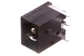

Contents
========

* [DJ2Z > ](#dj2z--)
	* [Datasheets](#datasheets)
	* [Labels](#labels)
	* [EDA](#eda)
	* [Images](#images)
	* [Tags](#tags)
  
![][im]
# DJ2Z > 

- ID: DCJP-21D-X-STAN-02
- Hex ID: DJ2Z
- Name: 
- Description: 
- Long Link: [http://oom.lt/DCJP-21D-X-STAN-02](http://oom.lt/DCJP-21D-X-STAN-02)
- Short Link: [http://oom.lt/DJ2Z](http://oom.lt/DJ2Z)

## Datasheets

- Datasheet: [datasheet.pdf](datasheet.pdf)

## Labels
  
  

|label-front|label-inventory|label-spec|
| :---: | :---: | :---: |
||||

## EDA

## Images
  
  

|image|image_RE|label-front|label-inventory|label-spec|
| :---: | :---: | :---: | :---: | :---: |
||||||

## Tags

- hexID: DJ2Z
- oompSort: 
- oompClass: Through Hole
- oompClassCode: THTH
- oompType: DCJP
- oompSize: 21D
- oompColor: X
- oompDesc: STAN
- oompIndex: 02
- oompVersion: 40
- ooDesignator: J1
- oompID: DCJP-21D-X-STAN-02

[im]: image_450.jpg
