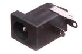
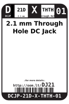
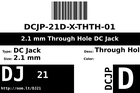

Contents
========

* [DJ21 > 2.1 mm Through Hole DC Jack](#dj21--21-mm-through-hole-dc-jack)
	* [Images](#images)
	* [Datasheets](#datasheets)
	* [Labels](#labels)
	* [EDA](#eda)
	* [Tags](#tags)
  
![][im]
# DJ21 > 2.1 mm Through Hole DC Jack

- ID: DCJP-21D-X-THTH-01
- Hex ID: DJ21
- Name: 2.1 mm Through Hole DC Jack
- Description: 2.1 mm Through Hole DC Jack

## Images
  
  

|image|image_RE|label-front|label-inventory|label-spec|
| :---: | :---: | :---: | :---: | :---: |
||||||

## Datasheets

- Datasheet: [datasheet.pdf](datasheet.pdf)

## Labels
  
  

|label-front|label-inventory|label-spec|
| :---: | :---: | :---: |
||||

## EDA

### Symbols

## Tags

- oompID: DCJP-21D-X-THTH-01
- name: 2.1 mm Through Hole DC Jack
- hexID: DJ21
- oompSort: THTH21D
- oompType: DCJP
- oompSize: 21D
- oompColor: X
- oompDesc: THTH
- oompIndex: 01
- oompVersion: 99
- ooWidth: 14.2 mm
- ooHeight: 11 mm
- ooLength: 9 mm
- ooManufacturer: C-BEST
- ooManufacturerPartNumber: DC-005
- ooNumPins: 3
- ooFootprint: OOMP-DCJP-21D-X-THTH-01
- useID: 1
- useID: 1
- importance: 1
- importance: 1
- useTitle: DC Input
- useTitle: Arduino Power
- useDescription: a socket for low voltage DC power.
- useDescription: Used as the power adapter jack on the Arduino UNO
- ooSEEEDsku: 3410020P1
- ooSEEEDdesc: CONN POWER JACK 2.1MM
- oompAbout: A commonly used adapter for connecting DC power to a project. Often reffered to as a barrel jack. It is common (although not always) practice to wire these up centre pin positive.
- ooSEEED3dModel: http://www.seeedstudio.com/wiki/File:PW-3P-2.1.zip
- oompClass: Through Hole Component
- oompClassCode: THTH
- ooDesignator: J1

[im]: image_450.jpg
