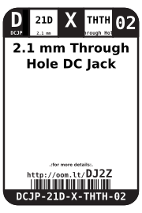
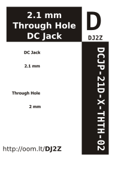

Contents
========

* [DCJP-21D-X-THTH-02>2.1 mm Through Hole DC Jack](#dcjp-21d-x-thth-0221-mm-through-hole-dc-jack)
	* [Images](#images)
	* [Datasheets](#datasheets)
	* [Labels](#labels)
	* [EDA](#eda)
		* [Symbols](#symbols)
	* [Tags](#tags)
  
![][im]
# DCJP-21D-X-THTH-02>2.1 mm Through Hole DC Jack

- ID: DCJP-21D-X-THTH-02
- Name: DCJP-21D-X-THTH-02

## Images
  
  

|image|image_RE|
| :---: | :---: |
|||

## Datasheets

- Datasheet: [datasheet.pdf](datasheet.pdf)

## Labels
  
  

|label-front|label-inventory|label-spec|
| :---: | :---: | :---: |
||||

## EDA

### Symbols

## Tags

- oompID: DCJP-21D-X-THTH-02
- name: 2.1 mm Through Hole DC Jack
- hexID: DJ2Z
- oompSort: 
- oompClass: Through Hole
- oompClassCode: THTH
- oompType: DCJP
- oompSize: 21D
- oompColor: X
- oompDesc: THTH
- oompIndex: 02
- oompVersion: 40
- ooDesignator: J1

[im]: image_600.jpg
