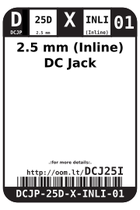
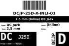
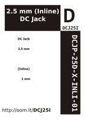

Contents
========

* [DCJ25I > 2.5 mm (Inline) DC Jack](#dcj25i--25-mm-inline-dc-jack)
	* [Labels](#labels)
	* [EDA](#eda)
	* [Images](#images)
	* [Tags](#tags)

# DCJ25I > 2.5 mm (Inline) DC Jack

- ID: DCJP-25D-X-INLI-01
- Hex ID: DCJ25I
- Name: 2.5 mm (Inline) DC Jack
- Description: 2.5 mm (Inline) DC Jack
- Long Link: [http://oom.lt/DCJP-25D-X-INLI-01](http://oom.lt/DCJP-25D-X-INLI-01)
- Short Link: [http://oom.lt/DCJ25I](http://oom.lt/DCJ25I)

## Labels
  
  

|label-front|label-inventory|label-spec|
| :---: | :---: | :---: |
||||

## EDA

### Symbols

## Images
  
  

|label-front|label-inventory|label-spec|
| :---: | :---: | :---: |
||||

## Tags

- oompType: DCJP
- oompSize: 25D
- oompColor: X
- oompDesc: INLI
- oompIndex: 01
- hexID: DCJ25I
- oompID: DCJP-25D-X-INLI-01
