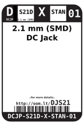
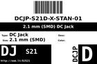
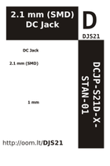

Contents
========

* [DJS21 > 2.1 mm (SMD) DC Jack](#djs21--21-mm-smd-dc-jack)
	* [Labels](#labels)
	* [EDA](#eda)
	* [Images](#images)
	* [Tags](#tags)

# DJS21 > 2.1 mm (SMD) DC Jack

- ID: DCJP-S21D-X-STAN-01
- Hex ID: DJS21
- Name: 2.1 mm (SMD) DC Jack
- Description: 2.1 mm (SMD) DC Jack
- Long Link: [http://oom.lt/DCJP-S21D-X-STAN-01](http://oom.lt/DCJP-S21D-X-STAN-01)
- Short Link: [http://oom.lt/DJS21](http://oom.lt/DJS21)

## Labels
  
  

|label-front|label-inventory|label-spec|
| :---: | :---: | :---: |
||||

## EDA
  

### Instances
  
Used 4 times.  
Prevalance: (4\10986) 0.0364%  

|OOMP Instances|
| :---: |
|[PROJ-SPAR-10025-STAN-01  EiBotBoard  Used 2 times. J6, J7](https://github.com/oomlout/oomlout_OOMP_projects/tree/main/PROJ-SPAR-10025-STAN-01/)|
|[PROJ-SPAR-12711-STAN-01  USB LiPolyCharger SingleCell  Used 1 times. J1](https://github.com/oomlout/oomlout_OOMP_projects/tree/main/PROJ-SPAR-12711-STAN-01/)|
|[PROJ-SPAR-13032-STAN-01  Breadboard Power Supply Stick 5V-3.3V  Used 1 times. J1](https://github.com/oomlout/oomlout_OOMP_projects/tree/main/PROJ-SPAR-13032-STAN-01/)|

## Images
  
  

|label-front|label-inventory|label-spec|
| :---: | :---: | :---: |
||||

## Tags

- oompType: DCJP
- oompSize: S21D
- oompColor: X
- oompDesc: STAN
- oompIndex: 01
- hexID: DJS21
- oompID: DCJP-S21D-X-STAN-01
- oompInstances: {'PROJECT': 'PROJ-SPAR-10025-STAN-01', 'ID': 'J6'}
- oompInstances: {'PROJECT': 'PROJ-SPAR-10025-STAN-01', 'ID': 'J7'}
- oompInstances: {'PROJECT': 'PROJ-SPAR-12711-STAN-01', 'ID': 'J1'}
- oompInstances: {'PROJECT': 'PROJ-SPAR-13032-STAN-01', 'ID': 'J1'}
