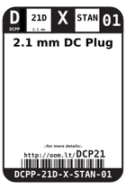
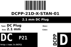
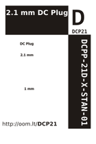

Contents
========

* [DCP21 > ](#dcp21--)
	* [Datasheets](#datasheets)
	* [Labels](#labels)
	* [EDA](#eda)
	* [Images](#images)
	* [Tags](#tags)

# DCP21 > 

- ID: DCPP-21D-X-STAN-01
- Hex ID: DCP21
- Name: 
- Description: 
- Long Link: [http://oom.lt/DCPP-21D-X-STAN-01](http://oom.lt/DCPP-21D-X-STAN-01)
- Short Link: [http://oom.lt/DCP21](http://oom.lt/DCP21)

## Datasheets

- Datasheet: [datasheet.pdf](datasheet.pdf)

## Labels
  
  

|label-front|label-inventory|label-spec|
| :---: | :---: | :---: |
||||

## EDA

## Images
  
  

|label-front|label-inventory|label-spec|
| :---: | :---: | :---: |
||||

## Tags

- oompType: DCPP
- oompSize: 21D
- oompColor: X
- oompDesc: STAN
- oompIndex: 01
- hexID: DCP21
- oompID: DCPP-21D-X-STAN-01
