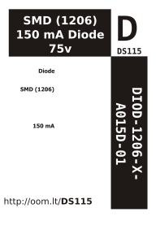

Contents
========

* [DIOD-1206-X-A015D-01>SMD (1206) 150 mA Diode 75v](#diod-1206-x-a015d-01smd-1206-150-ma-diode-75v)
	* [Datasheets](#datasheets)
	* [Labels](#labels)
	* [EDA](#eda)
		* [Symbols](#symbols)
	* [Tags](#tags)

# DIOD-1206-X-A015D-01>SMD (1206) 150 mA Diode 75v

- ID: DIOD-1206-X-A015D-01
- Name: DIOD-1206-X-A015D-01

## Datasheets

- Datasheet: [datasheet.pdf](datasheet.pdf)

## Labels
  
  

|label-front|label-inventory|label-spec|
| :---: | :---: | :---: |
||||

## EDA

### Symbols

## Tags

- oompID: DIOD-1206-X-A015D-01
- name: SMD (1206) 150 mA Diode 75v
- hexID: DS115
- oompSort: 12060.150
- oompType: DIOD
- oompSize: 1206
- oompColor: X
- oompDesc: A015D
- oompIndex: V7
- oompVersion: 99
- oompSkip: true
- ooWidth: 3 mm
- ooHeight: 0.95 mm
- ooLength: 1.6 mm
- ooNumPins: 2
- oompClass: Surface Mount
- oompClassCode: SMDS
- oompBbls: template;XXXX-1206-X-XXXX-XX-bbls
- oompDiag: template;XXXX-1206-X-XXXX-XX-diag
- oompIden: template;XXXX-1206-X-XXXX-XX-iden
- oompSchem: template;DIOD-XXXX-X-XXXX-XX-schem
- oompSimp: template;XXXX-1206-X-XXXX-XX-simp
- ooDesignator: D1
