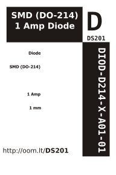

Contents
========

* [DIOD-D214-X-A01-01>SMD (DO-214) 1 Amp Diode](#diod-d214-x-a01-01smd-do-214-1-amp-diode)
	* [Images](#images)
	* [Datasheets](#datasheets)
	* [Labels](#labels)
	* [EDA](#eda)
		* [Symbols](#symbols)
	* [Tags](#tags)
  
![][im]
# DIOD-D214-X-A01-01>SMD (DO-214) 1 Amp Diode

- ID: DIOD-D214-X-A01-01
- Name: DIOD-D214-X-A01-01

## Images
  
  

|image|image_BOTTOM|
| :---: | :---: |
|||

## Datasheets

- Datasheet: [datasheet.pdf](datasheet.pdf)

## Labels
  
  

|label-front|label-inventory|label-spec|
| :---: | :---: | :---: |
||||

## EDA

### Symbols

## Tags

- oompID: DIOD-D214-X-A01-01
- name: SMD (DO-214) 1 Amp Diode
- hexID: DS201
- oompSort: D21401.000
- oompType: DIOD
- oompSize: D214
- oompColor: X
- oompDesc: A01
- oompIndex: 01
- oompVersion: 99
- oompSkip: true
- ooWidth: 5.6 mm
- ooHeight: 2 mm
- ooLength: 2.75 mm
- com: SMD
- ooPackageMarking: M7, S1M
- ooNumPins: 2
- oompAbout: This is a commonly used general purpose high current (1A) surface mount diode. 
- useID: 1
- importance: 1
- useTitle: Arduino Power protection
- useDescription: Used on the Arduino UNO board to protect agaionst inserting the DC power supply backwards.
- oompClass: Surface Mount
- oompClassCode: SMDS
- oompSchem: template;DIOD-XXXX-X-XXXX-XX-schem
- ooDesignator: D1

[im]: image_600.jpg
