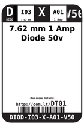
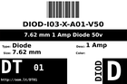
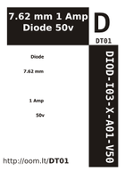

Contents
========

* [DT01 > 7.62 mm 1 Amp Diode 50v](#dt01--762-mm-1-amp-diode-50v)
	* [Images](#images)
	* [Datasheets](#datasheets)
	* [Labels](#labels)
	* [EDA](#eda)
	* [Tags](#tags)
  
![][im]
# DT01 > 7.62 mm 1 Amp Diode 50v

- ID: DIOD-I03-X-A01-V50
- Hex ID: DT01
- Name: 7.62 mm 1 Amp Diode 50v
- Description: 7.62 mm 1 Amp Diode 50v

## Images
  
  

|image|image_RE|label-front|label-inventory|label-spec|
| :---: | :---: | :---: | :---: | :---: |
||||||

## Datasheets

- Datasheet: [datasheet.pdf](datasheet.pdf)

## Labels
  
  

|label-front|label-inventory|label-spec|
| :---: | :---: | :---: |
||||

## EDA

### Symbols

## Tags

- oompID: DIOD-I03-X-A01-V50
- name: 7.62 mm 1 Amp Diode 50v
- hexID: DT01
- oompSort: THTH01.000
- oompType: DIOD
- oompSize: I03
- oompColor: X
- oompDesc: A01
- oompIndex: V50
- oompVersion: 99
- oompClass: Through Hole Component
- oompClassCode: THTH
- oompSchem: template;DIOD-XXXX-X-XXXX-XX-schem
- ooDesignator: D1

[im]: image_450.jpg
