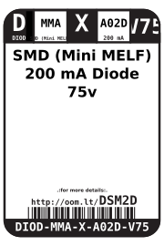

Contents
========

* [DIOD-MMA-X-A02D-V75>SMD (Mini MELF) 200 mA Diode 75v](#diod-mma-x-a02d-v75smd-mini-melf-200-ma-diode-75v)
	* [Datasheets](#datasheets)
	* [Labels](#labels)
	* [EDA](#eda)
		* [Symbols](#symbols)
	* [Tags](#tags)

# DIOD-MMA-X-A02D-V75>SMD (Mini MELF) 200 mA Diode 75v

- ID: DIOD-MMA-X-A02D-V75
- Name: DIOD-MMA-X-A02D-V75

## Datasheets

- Datasheet: [datasheet.pdf](datasheet.pdf)

## Labels
  
  

|label-front|label-inventory|label-spec|
| :---: | :---: | :---: |
||||

## EDA

### Symbols

## Tags

- oompID: DIOD-MMA-X-A02D-V75
- name: SMD (Mini MELF) 200 mA Diode 75v
- hexID: DSM2D
- oompSort: DIODMMAA02D
- oompType: DIOD
- oompSize: MMA
- oompColor: X
- oompDesc: A02D
- oompIndex: V75
- oompVersion: 98
- oompSchem: template;DIOD-XXXX-X-XXXX-XX-schem
- ooDesignator: D1
