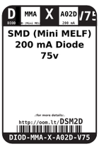
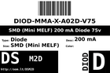
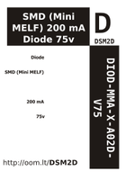

Contents
========

* [DSM2D > SMD (Mini MELF) 200 mA Diode 75v](#dsm2d--smd-mini-melf-200-ma-diode-75v)
	* [Datasheets](#datasheets)
	* [Labels](#labels)
	* [EDA](#eda)
	* [Images](#images)
	* [Tags](#tags)

# DSM2D > SMD (Mini MELF) 200 mA Diode 75v

- ID: DIOD-MMA-X-A02D-V75
- Hex ID: DSM2D
- Name: SMD (Mini MELF) 200 mA Diode 75v
- Description: SMD (Mini MELF) 200 mA Diode 75v
- Long Link: [http://oom.lt/DIOD-MMA-X-A02D-V75](http://oom.lt/DIOD-MMA-X-A02D-V75)
- Short Link: [http://oom.lt/DSM2D](http://oom.lt/DSM2D)

## Datasheets

- Datasheet: [datasheet.pdf](datasheet.pdf)

## Labels
  
  

|label-front|label-inventory|label-spec|
| :---: | :---: | :---: |
||||

## EDA

### Symbols

## Images
  
  

|label-front|label-inventory|label-spec|
| :---: | :---: | :---: |
||||

## Tags

- oompID: DIOD-MMA-X-A02D-V75
- name: SMD (Mini MELF) 200 mA Diode 75v
- hexID: DSM2D
- oompSort: DIODMMAA02D
- oompType: DIOD
- oompSize: MMA
- oompColor: X
- oompDesc: A02D
- oompIndex: V75
- oompVersion: 98
- oompSchem: template;DIOD-XXXX-X-XXXX-XX-schem
- ooDesignator: D1
