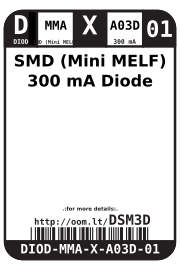
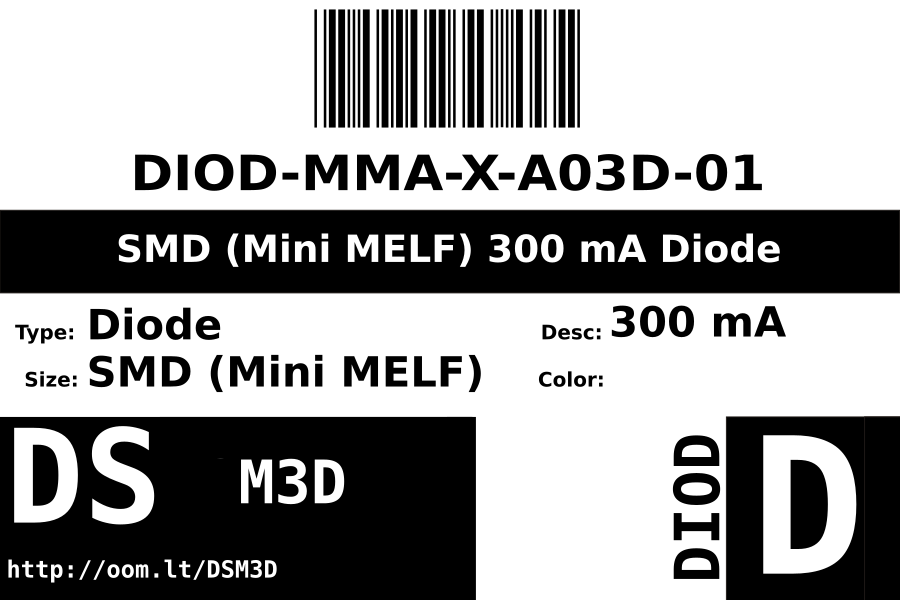

Contents
========

* [DIOD-MMA-X-A03D-01>SMD (Mini MELF) 300 mA Diode](#diod-mma-x-a03d-01smd-mini-melf-300-ma-diode)
	* [Images](#images)
	* [Datasheets](#datasheets)
	* [Labels](#labels)
	* [EDA](#eda)
		* [Symbols](#symbols)
	* [Tags](#tags)
  
![][im]
# DIOD-MMA-X-A03D-01>SMD (Mini MELF) 300 mA Diode

- ID: DIOD-MMA-X-A03D-01
- Name: DIOD-MMA-X-A03D-01

## Images
  
  

|image|
| :---: |
||

## Datasheets

- Datasheet: [datasheet.pdf](datasheet.pdf)

## Labels
  
  

|label-front|label-inventory|label-spec|
| :---: | :---: | :---: |
||||

## EDA

### Symbols

## Tags

- oompID: DIOD-MMA-X-A03D-01
- name: SMD (Mini MELF) 300 mA Diode
- hexID: DSM3D
- oompSort: 
- oompClass: Surface Mount
- oompClassCode: SMDS
- oompType: DIOD
- oompSize: MMA
- oompColor: X
- oompDesc: A03D
- oompIndex: 01
- oompVersion: 40
- oompSchem: template;DIOD-XXXX-X-XXXX-XX-schem
- ooDesignator: D1

[im]: image_600.jpg
