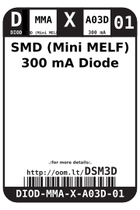
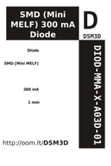

Contents
========

* [DSM3D > SMD (Mini MELF) 300 mA Diode](#dsm3d--smd-mini-melf-300-ma-diode)
	* [Datasheets](#datasheets)
	* [Labels](#labels)
	* [EDA](#eda)
	* [Images](#images)
	* [Tags](#tags)
  
![][im]
# DSM3D > SMD (Mini MELF) 300 mA Diode

- ID: DIOD-MMA-X-A03D-01
- Hex ID: DSM3D
- Name: SMD (Mini MELF) 300 mA Diode
- Description: SMD (Mini MELF) 300 mA Diode
- Long Link: [http://oom.lt/DIOD-MMA-X-A03D-01](http://oom.lt/DIOD-MMA-X-A03D-01)
- Long Link: [http://oom.lt/DSM3D](http://oom.lt/DSM3D)

## Datasheets

- Datasheet: [datasheet.pdf](datasheet.pdf)

## Labels
  
  

|label-front|label-inventory|label-spec|
| :---: | :---: | :---: |
||||

## EDA

### Symbols

## Images
  
  

|image|label-front|label-inventory|label-spec|
| :---: | :---: | :---: | :---: |
|||||

## Tags

- oompID: DIOD-MMA-X-A03D-01
- name: SMD (Mini MELF) 300 mA Diode
- hexID: DSM3D
- oompSort: 
- oompClass: Surface Mount
- oompClassCode: SMDS
- oompType: DIOD
- oompSize: MMA
- oompColor: X
- oompDesc: A03D
- oompIndex: 01
- oompVersion: 40
- oompSchem: template;DIOD-XXXX-X-XXXX-XX-schem
- ooDesignator: D1

[im]: image_450.jpg
