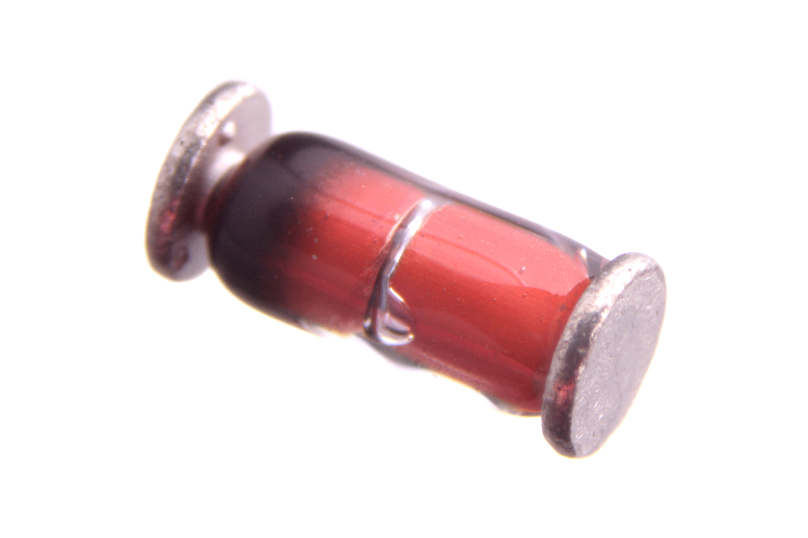

Contents
========

* [DIOD-MMA-X-A03D-01>SMD (Mini MELF) 300 mA Diode](#diod-mma-x-a03d-01smd-mini-melf-300-ma-diode)
	* [Images](#images)
	* [Datasheets](#datasheets)
	* [EDA](#eda)
		* [Footprints](#footprints)
		* [Symbols](#symbols)
	* [Tags](#tags)

# DIOD-MMA-X-A03D-01>SMD (Mini MELF) 300 mA Diode

- ID: DIOD-MMA-X-A03D-01
- Name: DIOD-MMA-X-A03D-01

## Images
  
  

|Main|
| :---: |
||

## Datasheets

- Datasheet: [datasheet.pdf](datasheet.pdf)

## EDA

### Footprints
  

|||||
| :---: | :---: | :---: | :---: |

### Symbols

## Tags

- index: 145
- oompID: DIOD-MMA-X-A03D-01
- name: SMD (Mini MELF) 300 mA Diode
- hexID: DSM3D
- oompSort: 
- oompClass: Surface Mount
- oompClassCode: SMDS
- oompType: DIOD
- oompSize: MMA
- oompColor: X
- oompDesc: A03D
- oompIndex: 01
- oompVersion: 40
- oompSchem: template;DIOD-XXXX-X-XXXX-XX-schem
- ooDesignator: D1
