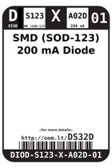

Contents
========

* [DS32D > SMD (SOD-123) 200 mA Diode](#ds32d--smd-sod-123-200-ma-diode)
	* [Datasheets](#datasheets)
	* [Labels](#labels)
	* [EDA](#eda)
	* [Images](#images)
	* [Tags](#tags)

# DS32D > SMD (SOD-123) 200 mA Diode

- ID: DIOD-S123-X-A02D-01
- Hex ID: DS32D
- Name: SMD (SOD-123) 200 mA Diode
- Description: SMD (SOD-123) 200 mA Diode
- Long Link: [http://oom.lt/DIOD-S123-X-A02D-01](http://oom.lt/DIOD-S123-X-A02D-01)
- Long Link: [http://oom.lt/DS32D](http://oom.lt/DS32D)

## Datasheets

- Datasheet: [datasheet.pdf](datasheet.pdf)

## Labels
  
  

|label-front|label-inventory|label-spec|
| :---: | :---: | :---: |
||||

## EDA

### Symbols

## Images
  
  

|label-front|label-inventory|label-spec|
| :---: | :---: | :---: |
||||

## Tags

- oompID: DIOD-S123-X-A02D-01
- name: SMD (SOD-123) 200 mA Diode
- hexID: DS32D
- oompSort: DIODS123A02D
- oompType: DIOD
- oompSize: S123
- oompColor: X
- oompDesc: A02D
- oompIndex: 01
- oompVersion: 98
- oompSchem: template;DIOD-XXXX-X-XXXX-XX-schem
- ooDesignator: D1
