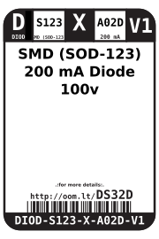
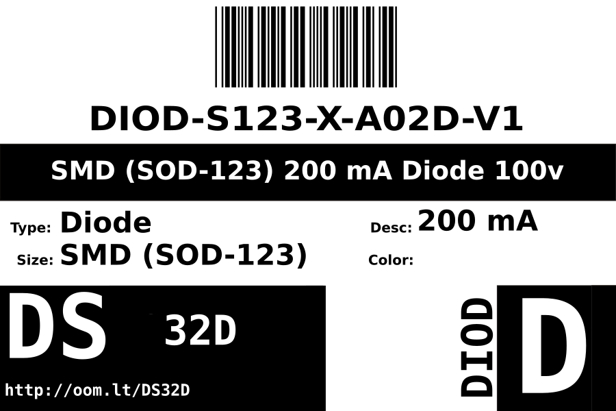
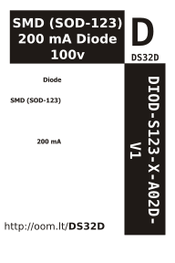

Contents
========

* [DIOD-S123-X-A02D-V1>SMD (SOD-123) 200 mA Diode](#diod-s123-x-a02d-v1smd-sod-123-200-ma-diode)
	* [Datasheets](#datasheets)
	* [Labels](#labels)
	* [EDA](#eda)
		* [Symbols](#symbols)
	* [Tags](#tags)

# DIOD-S123-X-A02D-V1>SMD (SOD-123) 200 mA Diode

- ID: DIOD-S123-X-A02D-V1
- Name: DIOD-S123-X-A02D-V1

## Datasheets

- Datasheet: [datasheet.pdf](datasheet.pdf)

## Labels
  
  

|Front|Inventory|Specifications|
| :---: | :---: | :---: |
||||

## EDA

### Symbols

## Tags

- hexID: DS32D
- oompSort: DIODS123A02D
- oompType: DIOD
- oompSize: S123
- oompColor: X
- oompDesc: A02D
- oompIndex: V1
- oompVersion: 98
- oompSchem: template;DIOD-XXXX-X-XXXX-XX-schem
- ooDesignator: D1
