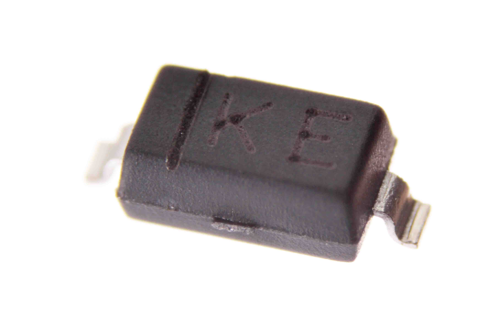

Contents
========

* [DIOD-S123-X-ESDP-01>SMD (SOD-123) ESD Protection Diode](#diod-s123-x-esdp-01smd-sod-123-esd-protection-diode)
	* [Images](#images)
	* [Datasheets](#datasheets)
	* [EDA](#eda)
		* [Symbols](#symbols)
	* [Tags](#tags)
  
![][im]
# DIOD-S123-X-ESDP-01>SMD (SOD-123) ESD Protection Diode

- ID: DIOD-S123-X-ESDP-01
- Name: DIOD-S123-X-ESDP-01

## Images
  
  

|Main|Bottom|
| :---: | :---: |
|||

## Datasheets

- Datasheet: [datasheet.pdf](datasheet.pdf)

## EDA

### Symbols

## Tags

- index: 149
- oompID: DIOD-S123-X-ESDP-01
- name: SMD (SOD-123) ESD Protection Diode
- hexID: DS3EP
- oompSort: 
- oompClass: Surface Mount
- oompClassCode: SMDS
- oompType: DIOD
- oompSize: S123
- oompColor: X
- oompDesc: ESDP
- oompIndex: 01
- oompVersion: 40
- oompSchem: template;DIOD-XXXX-X-XXXX-XX-schem
- ooDesignator: D1

[im]: image_600.jpg
