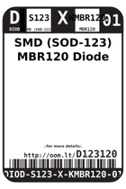
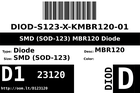
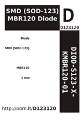

Contents
========

* [D123120 > SMD (SOD-123) MBR120 Diode](#d123120--smd-sod-123-mbr120-diode)
	* [Datasheets](#datasheets)
	* [Labels](#labels)
	* [EDA](#eda)
	* [Images](#images)
	* [Tags](#tags)

# D123120 > SMD (SOD-123) MBR120 Diode

- ID: DIOD-S123-X-KMBR120-01
- Hex ID: D123120
- Name: SMD (SOD-123) MBR120 Diode
- Description: SMD (SOD-123) MBR120 Diode
- Long Link: [http://oom.lt/DIOD-S123-X-KMBR120-01](http://oom.lt/DIOD-S123-X-KMBR120-01)
- Short Link: [http://oom.lt/D123120](http://oom.lt/D123120)

## Datasheets

- Datasheet: [datasheet.pdf](datasheet.pdf)

## Labels
  
  

|label-front|label-inventory|label-spec|
| :---: | :---: | :---: |
||||

## EDA
  

### Instances
  
Used 62 times.  
Prevalance: (62\10986) 0.5644%  

|OOMP Instances|
| :---: |
|[PROJ-ADAF-1588-STAN-01  Adafruit Bluefruit Classic PCBs  Used 1 times. D2](https://github.com/oomlout/oomlout_OOMP_projects/tree/main/PROJ-ADAF-1588-STAN-01/)|
|[PROJ-ADAF-1932-STAN-01  Adafruit RGB Matrix HAT PCB  Used 1 times. D1](https://github.com/oomlout/oomlout_OOMP_projects/tree/main/PROJ-ADAF-1932-STAN-01/)|
|[PROJ-ADAF-2078-STAN-01  Adafruit PowerBoost 500 Shield PCB  Used 1 times. D1](https://github.com/oomlout/oomlout_OOMP_projects/tree/main/PROJ-ADAF-2078-STAN-01/)|
|[PROJ-ADAF-2133-STAN-01  Adafruit Audio FX Sound Board PCBs  Used 2 times. D3, D4](https://github.com/oomlout/oomlout_OOMP_projects/tree/main/PROJ-ADAF-2133-STAN-01/)|
|[PROJ-ADAF-2268-STAN-01  Adafruit Particle Spark Neopixel Ring PCB  Used 1 times. D1](https://github.com/oomlout/oomlout_OOMP_projects/tree/main/PROJ-ADAF-2268-STAN-01/)|
|[PROJ-ADAF-2466-STAN-01  Adafruit METRO 328 PCB  Used 1 times. D1](https://github.com/oomlout/oomlout_OOMP_projects/tree/main/PROJ-ADAF-2466-STAN-01/)|
|[PROJ-ADAF-2471-STAN-01  Adafruit Huzzah ESP8266 Basic Breakout PCB  Used 2 times. D5, D6](https://github.com/oomlout/oomlout_OOMP_projects/tree/main/PROJ-ADAF-2471-STAN-01/)|
|[PROJ-ADAF-2479-STAN-01  Adafruit Bluefruit LE UART Friend PCB  Used 2 times. D3, D8](https://github.com/oomlout/oomlout_OOMP_projects/tree/main/PROJ-ADAF-2479-STAN-01/)|
|[PROJ-ADAF-2636-STAN-01  Adafruit FONA808 Shield PCB  Used 1 times. D8](https://github.com/oomlout/oomlout_OOMP_projects/tree/main/PROJ-ADAF-2636-STAN-01/)|
|[PROJ-ADAF-2661-STAN-01  Adafruit Bluefruit LE Micro PCB  Used 2 times. D3, D4](https://github.com/oomlout/oomlout_OOMP_projects/tree/main/PROJ-ADAF-2661-STAN-01/)|
|[PROJ-ADAF-2771-STAN-01  Adafruit Feather 32u4 Basic Proto PCB  Used 1 times. D4](https://github.com/oomlout/oomlout_OOMP_projects/tree/main/PROJ-ADAF-2771-STAN-01/)|
|[PROJ-ADAF-2772-STAN-01  Adafruit Feather M0 Basic Proto PCB  Used 1 times. D1](https://github.com/oomlout/oomlout_OOMP_projects/tree/main/PROJ-ADAF-2772-STAN-01/)|
|[PROJ-ADAF-2795-STAN-01  Adafruit Feather 32u4 Adalogger PCB  Used 1 times. D4](https://github.com/oomlout/oomlout_OOMP_projects/tree/main/PROJ-ADAF-2795-STAN-01/)|
|[PROJ-ADAF-2796-STAN-01  Adafruit Feather M0 Adalogger PCB  Used 1 times. D1](https://github.com/oomlout/oomlout_OOMP_projects/tree/main/PROJ-ADAF-2796-STAN-01/)|
|[PROJ-ADAF-2821-STAN-01  Adafruit Feather ESP8266 HUZZAH PCB  Used 1 times. D4](https://github.com/oomlout/oomlout_OOMP_projects/tree/main/PROJ-ADAF-2821-STAN-01/)|
|[PROJ-ADAF-2829-STAN-01  Adafruit Feather 32u4 Bluefruit LE PCB  Used 1 times. D4](https://github.com/oomlout/oomlout_OOMP_projects/tree/main/PROJ-ADAF-2829-STAN-01/)|
|[PROJ-ADAF-2945-STAN-01  Adafruit NeoPixel FeatherWing PCB  Used 2 times. D1, D2](https://github.com/oomlout/oomlout_OOMP_projects/tree/main/PROJ-ADAF-2945-STAN-01/)|
|[PROJ-ADAF-2995-STAN-01  Adafruit Feather M0 Bluefruit LE PCB  Used 1 times. D1](https://github.com/oomlout/oomlout_OOMP_projects/tree/main/PROJ-ADAF-2995-STAN-01/)|
|[PROJ-ADAF-3027-STAN-01  Adafruit Feather 32u4 FONA PCB  Used 1 times. D4](https://github.com/oomlout/oomlout_OOMP_projects/tree/main/PROJ-ADAF-3027-STAN-01/)|
|[PROJ-ADAF-3056-STAN-01  Adafruit WICED WiFi Feather PCB  Used 1 times. D1](https://github.com/oomlout/oomlout_OOMP_projects/tree/main/PROJ-ADAF-3056-STAN-01/)|
|[PROJ-ADAF-3178-STAN-01  Adafruit Feather M0 RFM LoRa PCB  Used 1 times. D1](https://github.com/oomlout/oomlout_OOMP_projects/tree/main/PROJ-ADAF-3178-STAN-01/)|
|[PROJ-ADAF-3200-STAN-01  Adafruit Teensy 3.x Feather Adapter PCB  Used 1 times. D4](https://github.com/oomlout/oomlout_OOMP_projects/tree/main/PROJ-ADAF-3200-STAN-01/)|
|[PROJ-ADAF-3211-STAN-01  Adafruit RGB Matrix Bonnet PCB  Used 1 times. D1](https://github.com/oomlout/oomlout_OOMP_projects/tree/main/PROJ-ADAF-3211-STAN-01/)|
|[PROJ-ADAF-3333-STAN-01  Adafruit Circuit Playground Express PCB  Used 2 times. D1, D2](https://github.com/oomlout/oomlout_OOMP_projects/tree/main/PROJ-ADAF-3333-STAN-01/)|
|[PROJ-ADAF-3382-STAN-01  Adafruit Metro M4 Express PCB  Used 1 times. D1](https://github.com/oomlout/oomlout_OOMP_projects/tree/main/PROJ-ADAF-3382-STAN-01/)|
|[PROJ-ADAF-3403-STAN-01  Adafruit Feather M0 Express PCB  Used 1 times. D1](https://github.com/oomlout/oomlout_OOMP_projects/tree/main/PROJ-ADAF-3403-STAN-01/)|
|[PROJ-ADAF-3405-STAN-01  Adafruit HUZZAH32 ESP32 Feather PCB  Used 1 times. D4](https://github.com/oomlout/oomlout_OOMP_projects/tree/main/PROJ-ADAF-3405-STAN-01/)|
|[PROJ-ADAF-3449-STAN-01  Adafruit DotStar FeatherWing PCB  Used 2 times. D1, D2](https://github.com/oomlout/oomlout_OOMP_projects/tree/main/PROJ-ADAF-3449-STAN-01/)|
|[PROJ-ADAF-3458-STAN-01  Adafruit Feather 328P PCB  Used 1 times. D4](https://github.com/oomlout/oomlout_OOMP_projects/tree/main/PROJ-ADAF-3458-STAN-01/)|
|[PROJ-ADAF-3505-STAN-01  Adafruit Metro M0 Express PCB  Used 1 times. D1](https://github.com/oomlout/oomlout_OOMP_projects/tree/main/PROJ-ADAF-3505-STAN-01/)|
|[PROJ-ADAF-3651-STAN-01  Adafruit 3.5in TFT Featherwing PCB  Used 2 times. D3, D4](https://github.com/oomlout/oomlout_OOMP_projects/tree/main/PROJ-ADAF-3651-STAN-01/)|
|[PROJ-ADAF-3677-STAN-01  Adafruit ItsyBitsy 32u4 PCB  Used 1 times. D1](https://github.com/oomlout/oomlout_OOMP_projects/tree/main/PROJ-ADAF-3677-STAN-01/)|
|[PROJ-ADAF-3727-STAN-01  Adafruit ItsyBitsy M0 PCB  Used 2 times. D1, D2](https://github.com/oomlout/oomlout_OOMP_projects/tree/main/PROJ-ADAF-3727-STAN-01/)|
|[PROJ-ADAF-3800-STAN-01  Adafruit ItsyBitsy M4 Express PCB  Used 2 times. D1, D2](https://github.com/oomlout/oomlout_OOMP_projects/tree/main/PROJ-ADAF-3800-STAN-01/)|
|[PROJ-ADAF-3857-STAN-01  Adafruit Feather M4 Express PCB  Used 1 times. D4](https://github.com/oomlout/oomlout_OOMP_projects/tree/main/PROJ-ADAF-3857-STAN-01/)|
|[PROJ-ADAF-390-STAN-01  USB DC Solar Lithium Ion Polymer charger  Used 1 times. D1](https://github.com/oomlout/oomlout_OOMP_projects/tree/main/PROJ-ADAF-390-STAN-01/)|
|[PROJ-ADAF-3900-STAN-01  Adafruit Hallowing M0 PCB  Used 1 times. D4](https://github.com/oomlout/oomlout_OOMP_projects/tree/main/PROJ-ADAF-3900-STAN-01/)|
|[PROJ-ADAF-3988-STAN-01  Adafruit Prop Maker FeatherWing PCB  Used 2 times. D1, D2](https://github.com/oomlout/oomlout_OOMP_projects/tree/main/PROJ-ADAF-3988-STAN-01/)|
|[PROJ-ADAF-4000-STAN-01  Adafruit Metro M4 Express AirLift PCB  Used 1 times. D1](https://github.com/oomlout/oomlout_OOMP_projects/tree/main/PROJ-ADAF-4000-STAN-01/)|
|[PROJ-ADAF-4064-STAN-01  Adafruit Grand Central PCB  Used 1 times. D1](https://github.com/oomlout/oomlout_OOMP_projects/tree/main/PROJ-ADAF-4064-STAN-01/)|
|[PROJ-ADAF-4172-STAN-01  Adafruit ESP32 HUZZAH Breakout PCB  Used 2 times. D5, D6](https://github.com/oomlout/oomlout_OOMP_projects/tree/main/PROJ-ADAF-4172-STAN-01/)|
|[PROJ-ADAF-4333-STAN-01  Adafruit Circuit Playground Bluefruit PCB  Used 2 times. D1, D2](https://github.com/oomlout/oomlout_OOMP_projects/tree/main/PROJ-ADAF-4333-STAN-01/)|
|[PROJ-ADAF-4481-STAN-01  Adafruit ItsyBitsy nRF52840 Express PCB  Used 2 times. D1, D3](https://github.com/oomlout/oomlout_OOMP_projects/tree/main/PROJ-ADAF-4481-STAN-01/)|
|[PROJ-ADAF-4500-STAN-01  Adafruit CLUE PCB  Used 2 times. D1, D5](https://github.com/oomlout/oomlout_OOMP_projects/tree/main/PROJ-ADAF-4500-STAN-01/)|
|[PROJ-ADAF-4741-STAN-01  Adafruit Grayscale 1.5 inch 128x128 OLED PCB  Used 1 times. D2](https://github.com/oomlout/oomlout_OOMP_projects/tree/main/PROJ-ADAF-4741-STAN-01/)|
|[PROJ-ADAF-5297-STAN-01  Adafruit 1.12in 128x128 OLED PCB  Used 1 times. D2](https://github.com/oomlout/oomlout_OOMP_projects/tree/main/PROJ-ADAF-5297-STAN-01/)|
|[PROJ-ADAF-5397-STAN-01  Adafruit Charger BFF PCB  Used 1 times. D2](https://github.com/oomlout/oomlout_OOMP_projects/tree/main/PROJ-ADAF-5397-STAN-01/)|

## Images
  
  

|label-front|label-inventory|label-spec|
| :---: | :---: | :---: |
||||

## Tags

- oompType: DIOD
- oompSize: S123
- oompColor: X
- oompDesc: KMBR120
- oompIndex: 01
- hexID: D123120
- oompID: DIOD-S123-X-KMBR120-01
- oompInstances: {'PROJECT': 'PROJ-ADAF-1588-STAN-01', 'ID': 'D2'}
- oompInstances: {'PROJECT': 'PROJ-ADAF-1932-STAN-01', 'ID': 'D1'}
- oompInstances: {'PROJECT': 'PROJ-ADAF-2078-STAN-01', 'ID': 'D1'}
- oompInstances: {'PROJECT': 'PROJ-ADAF-2133-STAN-01', 'ID': 'D3'}
- oompInstances: {'PROJECT': 'PROJ-ADAF-2133-STAN-01', 'ID': 'D4'}
- oompInstances: {'PROJECT': 'PROJ-ADAF-2268-STAN-01', 'ID': 'D1'}
- oompInstances: {'PROJECT': 'PROJ-ADAF-2466-STAN-01', 'ID': 'D1'}
- oompInstances: {'PROJECT': 'PROJ-ADAF-2471-STAN-01', 'ID': 'D5'}
- oompInstances: {'PROJECT': 'PROJ-ADAF-2471-STAN-01', 'ID': 'D6'}
- oompInstances: {'PROJECT': 'PROJ-ADAF-2479-STAN-01', 'ID': 'D3'}
- oompInstances: {'PROJECT': 'PROJ-ADAF-2479-STAN-01', 'ID': 'D8'}
- oompInstances: {'PROJECT': 'PROJ-ADAF-2636-STAN-01', 'ID': 'D8'}
- oompInstances: {'PROJECT': 'PROJ-ADAF-2661-STAN-01', 'ID': 'D3'}
- oompInstances: {'PROJECT': 'PROJ-ADAF-2661-STAN-01', 'ID': 'D4'}
- oompInstances: {'PROJECT': 'PROJ-ADAF-2771-STAN-01', 'ID': 'D4'}
- oompInstances: {'PROJECT': 'PROJ-ADAF-2772-STAN-01', 'ID': 'D1'}
- oompInstances: {'PROJECT': 'PROJ-ADAF-2795-STAN-01', 'ID': 'D4'}
- oompInstances: {'PROJECT': 'PROJ-ADAF-2796-STAN-01', 'ID': 'D1'}
- oompInstances: {'PROJECT': 'PROJ-ADAF-2821-STAN-01', 'ID': 'D4'}
- oompInstances: {'PROJECT': 'PROJ-ADAF-2829-STAN-01', 'ID': 'D4'}
- oompInstances: {'PROJECT': 'PROJ-ADAF-2945-STAN-01', 'ID': 'D1'}
- oompInstances: {'PROJECT': 'PROJ-ADAF-2945-STAN-01', 'ID': 'D2'}
- oompInstances: {'PROJECT': 'PROJ-ADAF-2995-STAN-01', 'ID': 'D1'}
- oompInstances: {'PROJECT': 'PROJ-ADAF-3027-STAN-01', 'ID': 'D4'}
- oompInstances: {'PROJECT': 'PROJ-ADAF-3056-STAN-01', 'ID': 'D1'}
- oompInstances: {'PROJECT': 'PROJ-ADAF-3178-STAN-01', 'ID': 'D1'}
- oompInstances: {'PROJECT': 'PROJ-ADAF-3200-STAN-01', 'ID': 'D4'}
- oompInstances: {'PROJECT': 'PROJ-ADAF-3211-STAN-01', 'ID': 'D1'}
- oompInstances: {'PROJECT': 'PROJ-ADAF-3333-STAN-01', 'ID': 'D1'}
- oompInstances: {'PROJECT': 'PROJ-ADAF-3333-STAN-01', 'ID': 'D2'}
- oompInstances: {'PROJECT': 'PROJ-ADAF-3382-STAN-01', 'ID': 'D1'}
- oompInstances: {'PROJECT': 'PROJ-ADAF-3403-STAN-01', 'ID': 'D1'}
- oompInstances: {'PROJECT': 'PROJ-ADAF-3405-STAN-01', 'ID': 'D4'}
- oompInstances: {'PROJECT': 'PROJ-ADAF-3449-STAN-01', 'ID': 'D1'}
- oompInstances: {'PROJECT': 'PROJ-ADAF-3449-STAN-01', 'ID': 'D2'}
- oompInstances: {'PROJECT': 'PROJ-ADAF-3458-STAN-01', 'ID': 'D4'}
- oompInstances: {'PROJECT': 'PROJ-ADAF-3505-STAN-01', 'ID': 'D1'}
- oompInstances: {'PROJECT': 'PROJ-ADAF-3651-STAN-01', 'ID': 'D3'}
- oompInstances: {'PROJECT': 'PROJ-ADAF-3651-STAN-01', 'ID': 'D4'}
- oompInstances: {'PROJECT': 'PROJ-ADAF-3677-STAN-01', 'ID': 'D1'}
- oompInstances: {'PROJECT': 'PROJ-ADAF-3727-STAN-01', 'ID': 'D1'}
- oompInstances: {'PROJECT': 'PROJ-ADAF-3727-STAN-01', 'ID': 'D2'}
- oompInstances: {'PROJECT': 'PROJ-ADAF-3800-STAN-01', 'ID': 'D1'}
- oompInstances: {'PROJECT': 'PROJ-ADAF-3800-STAN-01', 'ID': 'D2'}
- oompInstances: {'PROJECT': 'PROJ-ADAF-3857-STAN-01', 'ID': 'D4'}
- oompInstances: {'PROJECT': 'PROJ-ADAF-390-STAN-01', 'ID': 'D1'}
- oompInstances: {'PROJECT': 'PROJ-ADAF-3900-STAN-01', 'ID': 'D4'}
- oompInstances: {'PROJECT': 'PROJ-ADAF-3988-STAN-01', 'ID': 'D1'}
- oompInstances: {'PROJECT': 'PROJ-ADAF-3988-STAN-01', 'ID': 'D2'}
- oompInstances: {'PROJECT': 'PROJ-ADAF-4000-STAN-01', 'ID': 'D1'}
- oompInstances: {'PROJECT': 'PROJ-ADAF-4064-STAN-01', 'ID': 'D1'}
- oompInstances: {'PROJECT': 'PROJ-ADAF-4172-STAN-01', 'ID': 'D5'}
- oompInstances: {'PROJECT': 'PROJ-ADAF-4172-STAN-01', 'ID': 'D6'}
- oompInstances: {'PROJECT': 'PROJ-ADAF-4333-STAN-01', 'ID': 'D1'}
- oompInstances: {'PROJECT': 'PROJ-ADAF-4333-STAN-01', 'ID': 'D2'}
- oompInstances: {'PROJECT': 'PROJ-ADAF-4481-STAN-01', 'ID': 'D1'}
- oompInstances: {'PROJECT': 'PROJ-ADAF-4481-STAN-01', 'ID': 'D3'}
- oompInstances: {'PROJECT': 'PROJ-ADAF-4500-STAN-01', 'ID': 'D1'}
- oompInstances: {'PROJECT': 'PROJ-ADAF-4500-STAN-01', 'ID': 'D5'}
- oompInstances: {'PROJECT': 'PROJ-ADAF-4741-STAN-01', 'ID': 'D2'}
- oompInstances: {'PROJECT': 'PROJ-ADAF-5297-STAN-01', 'ID': 'D2'}
- oompInstances: {'PROJECT': 'PROJ-ADAF-5397-STAN-01', 'ID': 'D2'}
