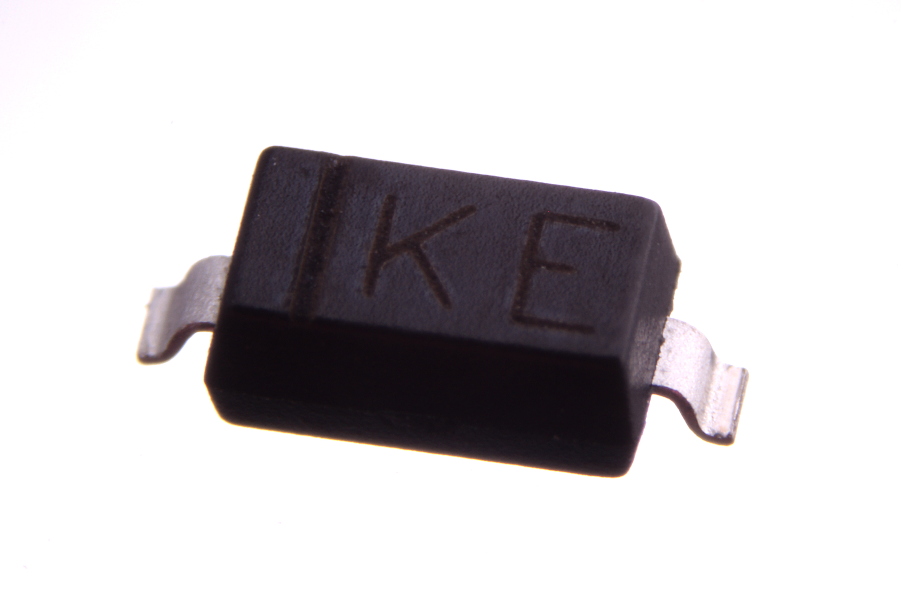
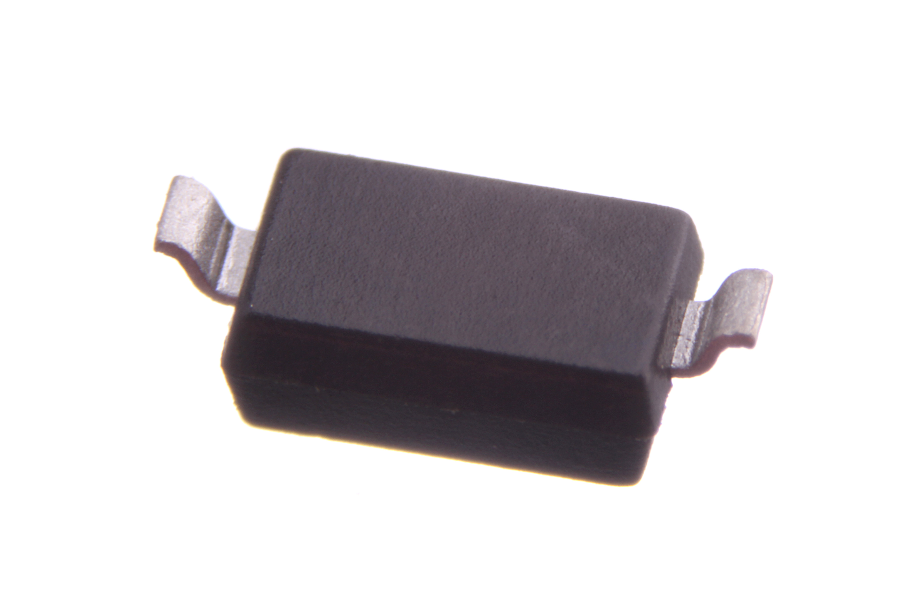

Contents
========

* [DIOD-S123-X-STAN-01>SMD (SOD-123) Diode](#diod-s123-x-stan-01smd-sod-123-diode)
	* [Images](#images)
	* [Datasheets](#datasheets)
	* [EDA](#eda)
		* [Footprints](#footprints)
		* [Symbols](#symbols)
	* [Tags](#tags)

# DIOD-S123-X-STAN-01>SMD (SOD-123) Diode

- ID: DIOD-S123-X-STAN-01
- Name: DIOD-S123-X-STAN-01

## Images
  
  

|Main|Bottom|
| :---: | :---: |
|||

## Datasheets

- Datasheet: [datasheet.pdf](datasheet.pdf)

## EDA

### Footprints
  

|||||
| :---: | :---: | :---: | :---: |

### Symbols

## Tags

- index: 150
- index: 4185
- oompID: DIOD-S123-X-STAN-01
- name: SMD (SOD-123) Diode
- hexID: DS301
- oompSort: S123000
- oompType: DIOD
- oompSize: S123
- oompColor: X
- oompDesc: STAN
- oompIndex: 01
- oompVersion: 99
- oompClass: Surface Mount
- oompClassCode: SMDS
- oompSchem: template;DIOD-XXXX-X-XXXX-XX-schem
- ooDesignator: D1
