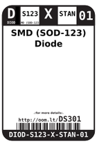
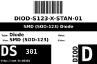
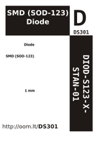
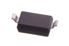

Contents
========

* [DS301 > SMD (SOD-123) Diode](#ds301--smd-sod-123-diode)
	* [Datasheets](#datasheets)
	* [Labels](#labels)
	* [EDA](#eda)
	* [Images](#images)
	* [Tags](#tags)
  
![][im]
# DS301 > SMD (SOD-123) Diode

- ID: DIOD-S123-X-STAN-01
- Hex ID: DS301
- Name: SMD (SOD-123) Diode
- Description: SMD (SOD-123) Diode
- Long Link: [http://oom.lt/DIOD-S123-X-STAN-01](http://oom.lt/DIOD-S123-X-STAN-01)
- Short Link: [http://oom.lt/DS301](http://oom.lt/DS301)

## Datasheets

- Datasheet: [datasheet.pdf](datasheet.pdf)

## Labels
  
  

|label-front|label-inventory|label-spec|
| :---: | :---: | :---: |
||||

## EDA

## Images
  
  

|image|image_BOTTOM|label-front|label-inventory|label-spec|
| :---: | :---: | :---: | :---: | :---: |
||||||

## Tags

- oompID: DIOD-S123-X-STAN-01
- name: SMD (SOD-123) Diode
- hexID: DS301
- oompSort: S123000
- oompType: DIOD
- oompSize: S123
- oompColor: X
- oompDesc: STAN
- oompIndex: 01
- oompVersion: 99
- oompClass: Surface Mount
- oompClassCode: SMDS
- oompSchem: template;DIOD-XXXX-X-XXXX-XX-schem
- ooDesignator: D1

[im]: image_450.jpg
