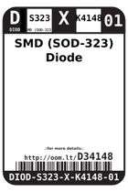
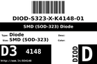
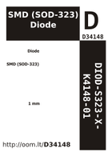

Contents
========

* [D34148 > SMD (SOD-323) Diode](#d34148--smd-sod-323-diode)
	* [Labels](#labels)
	* [EDA](#eda)
	* [Images](#images)
	* [Tags](#tags)

# D34148 > SMD (SOD-323) Diode

- ID: DIOD-S323-X-K4148-01
- Hex ID: D34148
- Name: SMD (SOD-323) Diode
- Description: SMD (SOD-323) Diode
- Long Link: [http://oom.lt/DIOD-S323-X-K4148-01](http://oom.lt/DIOD-S323-X-K4148-01)
- Short Link: [http://oom.lt/D34148](http://oom.lt/D34148)

## Labels
  
  

|label-front|label-inventory|label-spec|
| :---: | :---: | :---: |
||||

## EDA

### Instances
  
  
Used 165 times.  
Prevalance: (165\9905) 1.6658%  

|OOMP Instances|
| :---: |
|[PROJ-ADAF-1032-STAN-01  Adafruit L3GD20 Breakout PCB  Used 1 times. D1](https://github.com/oomlout/oomlout_OOMP_projects/tree/main/PROJ-ADAF-1032-STAN-01/)|
|[PROJ-ADAF-1231-STAN-01  Adafruit_ADXL345_PCB  Used 1 times. D2](https://github.com/oomlout/oomlout_OOMP_projects/tree/main/PROJ-ADAF-1231-STAN-01/)|
|[PROJ-ADAF-1381-STAN-01  Adafruit VS1053 Breakout PCB  Used 1 times. D1](https://github.com/oomlout/oomlout_OOMP_projects/tree/main/PROJ-ADAF-1381-STAN-01/)|
|[PROJ-ADAF-1535-STAN-01  Adafruit Bluefruit EZ Key PCB  Used 1 times. D1](https://github.com/oomlout/oomlout_OOMP_projects/tree/main/PROJ-ADAF-1535-STAN-01/)|
|[PROJ-ADAF-1571-STAN-01  Adafruit STMPE610 Breakout PCB  Used 1 times. D1](https://github.com/oomlout/oomlout_OOMP_projects/tree/main/PROJ-ADAF-1571-STAN-01/)|
|[PROJ-ADAF-1580-STAN-01  Adafruit AR1100 Resistive Touch Controller PCB  Used 2 times. D2, D3](https://github.com/oomlout/oomlout_OOMP_projects/tree/main/PROJ-ADAF-1580-STAN-01/)|
|[PROJ-ADAF-1590-STAN-01  Adafruit RA8875 Breakout Board PCB  Used 2 times. D3, D4](https://github.com/oomlout/oomlout_OOMP_projects/tree/main/PROJ-ADAF-1590-STAN-01/)|
|[PROJ-ADAF-1611-STAN-01  Adafruit_Trellis  Used 12 times. D1, D2, D4, D5, D6, D7, D8, D9, D10, D11, D12, D13](https://github.com/oomlout/oomlout_OOMP_projects/tree/main/PROJ-ADAF-1611-STAN-01/)|
|[PROJ-ADAF-1651-STAN-01  Adafruit 2.8 TFT Shield v2 PCB  Used 1 times. D1](https://github.com/oomlout/oomlout_OOMP_projects/tree/main/PROJ-ADAF-1651-STAN-01/)|
|[PROJ-ADAF-1673-STAN-01  Adafruit 1.27inch Color OLED Breakout PCB  Used 2 times. D1, D3](https://github.com/oomlout/oomlout_OOMP_projects/tree/main/PROJ-ADAF-1673-STAN-01/)|
|[PROJ-ADAF-1716-STAN-01  Adafruit Qualia Driver PCB  Used 1 times. D2](https://github.com/oomlout/oomlout_OOMP_projects/tree/main/PROJ-ADAF-1716-STAN-01/)|
|[PROJ-ADAF-1752-STAN-01  Adafruit MAX9744 Amplifier PCB  Used 4 times. D1, D2, D3, D4](https://github.com/oomlout/oomlout_OOMP_projects/tree/main/PROJ-ADAF-1752-STAN-01/)|
|[PROJ-ADAF-1788-STAN-01  Adafruit Music Maker MP3 Shield PCB  Used 2 times. D1, D2](https://github.com/oomlout/oomlout_OOMP_projects/tree/main/PROJ-ADAF-1788-STAN-01/)|
|[PROJ-ADAF-1900-STAN-01  Adafruit BMP183 Breakout PCB  Used 3 times. D1, D2, D3](https://github.com/oomlout/oomlout_OOMP_projects/tree/main/PROJ-ADAF-1900-STAN-01/)|
|[PROJ-ADAF-1958-STAN-01  Adafruit Si4713 PCB  Used 2 times. D1, D2](https://github.com/oomlout/oomlout_OOMP_projects/tree/main/PROJ-ADAF-1958-STAN-01/)|
|[PROJ-ADAF-1963-STAN-01  Adafruit FONA 800 GSM Breakout PCB  Used 4 times. D3, D4, D5, D6](https://github.com/oomlout/oomlout_OOMP_projects/tree/main/PROJ-ADAF-1963-STAN-01/)|
|[PROJ-ADAF-2021-STAN-01  Adafruit LSM9DS0 PCB  Used 3 times. D1, D2, D3](https://github.com/oomlout/oomlout_OOMP_projects/tree/main/PROJ-ADAF-2021-STAN-01/)|
|[PROJ-ADAF-2050-STAN-01  3.5inch TFT Breakout PCB  Used 1 times. D4](https://github.com/oomlout/oomlout_OOMP_projects/tree/main/PROJ-ADAF-2050-STAN-01/)|
|[PROJ-ADAF-2133-STAN-01  Adafruit Audio FX Sound Board PCBs  Used 1 times. D2](https://github.com/oomlout/oomlout_OOMP_projects/tree/main/PROJ-ADAF-2133-STAN-01/)|
|[PROJ-ADAF-2260-STAN-01  Adafruit 5 HDMI Backpack PCB  Used 1 times. D3](https://github.com/oomlout/oomlout_OOMP_projects/tree/main/PROJ-ADAF-2260-STAN-01/)|
|[PROJ-ADAF-2298-STAN-01  Adafruit PiTFT Plus 2.8 PCB  Used 2 times. D1, D2](https://github.com/oomlout/oomlout_OOMP_projects/tree/main/PROJ-ADAF-2298-STAN-01/)|
|[PROJ-ADAF-2406-STAN-01  Adafruit 7 HDMI Backpack PCB  Used 1 times. D3](https://github.com/oomlout/oomlout_OOMP_projects/tree/main/PROJ-ADAF-2406-STAN-01/)|
|[PROJ-ADAF-2453-STAN-01  Adafruit DPI Kippah PCB  Used 1 times. D3](https://github.com/oomlout/oomlout_OOMP_projects/tree/main/PROJ-ADAF-2453-STAN-01/)|
|[PROJ-ADAF-2455-STAN-01  Adafruit PiTFT 2.4 Inch HAT PCB  Used 1 times. D1](https://github.com/oomlout/oomlout_OOMP_projects/tree/main/PROJ-ADAF-2455-STAN-01/)|
|[PROJ-ADAF-2466-STAN-01  Adafruit METRO 328 PCB  Used 1 times. D2](https://github.com/oomlout/oomlout_OOMP_projects/tree/main/PROJ-ADAF-2466-STAN-01/)|
|[PROJ-ADAF-2468-STAN-01  Adafruit FONA 800 Shield PCB  Used 5 times. D3, D4, D5, D6, D8](https://github.com/oomlout/oomlout_OOMP_projects/tree/main/PROJ-ADAF-2468-STAN-01/)|
|[PROJ-ADAF-2471-STAN-01  Adafruit Huzzah ESP8266 Basic Breakout PCB  Used 2 times. D1, D2](https://github.com/oomlout/oomlout_OOMP_projects/tree/main/PROJ-ADAF-2471-STAN-01/)|
|[PROJ-ADAF-2472-STAN-01  Adafruit BNO055 Breakout PCB  Used 1 times. D1](https://github.com/oomlout/oomlout_OOMP_projects/tree/main/PROJ-ADAF-2472-STAN-01/)|
|[PROJ-ADAF-2479-STAN-01  Adafruit Bluefruit LE UART Friend PCB  Used 4 times. D4, D5, D6, D7](https://github.com/oomlout/oomlout_OOMP_projects/tree/main/PROJ-ADAF-2479-STAN-01/)|
|[PROJ-ADAF-2542-STAN-01  Adafruit FONA 808 Breakout PCB  Used 5 times. D3, D4, D5, D6, D7](https://github.com/oomlout/oomlout_OOMP_projects/tree/main/PROJ-ADAF-2542-STAN-01/)|
|[PROJ-ADAF-2616-STAN-01  Adafruit PiTFT Plus 3.2 PCB  Used 2 times. D3, D4](https://github.com/oomlout/oomlout_OOMP_projects/tree/main/PROJ-ADAF-2616-STAN-01/)|
|[PROJ-ADAF-2633-STAN-01  Adafruit Bluefruit LE SPI Friend PCB  Used 1 times. D3](https://github.com/oomlout/oomlout_OOMP_projects/tree/main/PROJ-ADAF-2633-STAN-01/)|
|[PROJ-ADAF-2636-STAN-01  Adafruit FONA808 Shield PCB  Used 6 times. D3, D4, D5, D6, D7, D9](https://github.com/oomlout/oomlout_OOMP_projects/tree/main/PROJ-ADAF-2636-STAN-01/)|
|[PROJ-ADAF-2651-STAN-01  Adafruit BMP280 Breakout PCB  Used 1 times. D2](https://github.com/oomlout/oomlout_OOMP_projects/tree/main/PROJ-ADAF-2651-STAN-01/)|
|[PROJ-ADAF-2652-STAN-01  Adafruit BME280 Breakout PCB  Used 1 times. D2](https://github.com/oomlout/oomlout_OOMP_projects/tree/main/PROJ-ADAF-2652-STAN-01/)|
|[PROJ-ADAF-269-STAN-01  Adafruit MAX31855 breakout board  Used 2 times. D1, D2](https://github.com/oomlout/oomlout_OOMP_projects/tree/main/PROJ-ADAF-269-STAN-01/)|
|[PROJ-ADAF-2746-STAN-01  Adafruit Bluefruit LE Shield PCB  Used 1 times. D3](https://github.com/oomlout/oomlout_OOMP_projects/tree/main/PROJ-ADAF-2746-STAN-01/)|
|[PROJ-ADAF-2809-STAN-01  Adafruit LIS3DH Breakout PCB  Used 1 times. D2](https://github.com/oomlout/oomlout_OOMP_projects/tree/main/PROJ-ADAF-2809-STAN-01/)|
|[PROJ-ADAF-2923-STAN-01  Adafruit Relay FeatherWing PCBs  Used 1 times. D1](https://github.com/oomlout/oomlout_OOMP_projects/tree/main/PROJ-ADAF-2923-STAN-01/)|
|[PROJ-ADAF-3000-STAN-01  Adafruit Circuit Playground PCB  Used 1 times. D4](https://github.com/oomlout/oomlout_OOMP_projects/tree/main/PROJ-ADAF-3000-STAN-01/)|
|[PROJ-ADAF-3027-STAN-01  Adafruit Feather 32u4 FONA PCB  Used 4 times. D1, D3, D7, D9](https://github.com/oomlout/oomlout_OOMP_projects/tree/main/PROJ-ADAF-3027-STAN-01/)|
|[PROJ-ADAF-3088-STAN-01  Adafruit LED Backpack FeatherWing PCB  Used 1 times. D1](https://github.com/oomlout/oomlout_OOMP_projects/tree/main/PROJ-ADAF-3088-STAN-01/)|
|[PROJ-ADAF-3191-STAN-01  Adafruit Power Relay FeatherWing PCB  Used 1 times. D1](https://github.com/oomlout/oomlout_OOMP_projects/tree/main/PROJ-ADAF-3191-STAN-01/)|
|[PROJ-ADAF-3263-STAN-01  Adafruit MAX31856 PCB  Used 3 times. D1, D2, D3](https://github.com/oomlout/oomlout_OOMP_projects/tree/main/PROJ-ADAF-3263-STAN-01/)|
|[PROJ-ADAF-3316-STAN-01  Adafruit VL6180X ToF Distance Sensor PCB  Used 1 times. D1](https://github.com/oomlout/oomlout_OOMP_projects/tree/main/PROJ-ADAF-3316-STAN-01/)|
|[PROJ-ADAF-3317-STAN-01  Adafruit VL53L0X ToF Distance Sensor PCB  Used 1 times. D1](https://github.com/oomlout/oomlout_OOMP_projects/tree/main/PROJ-ADAF-3317-STAN-01/)|
|[PROJ-ADAF-3328-STAN-01  Adafruit MAX31865 PCB  Used 3 times. D1, D2, D3](https://github.com/oomlout/oomlout_OOMP_projects/tree/main/PROJ-ADAF-3328-STAN-01/)|
|[PROJ-ADAF-3387-STAN-01  Adafruit LSM9DS1 Breakout PCB  Used 3 times. D2, D3, D4](https://github.com/oomlout/oomlout_OOMP_projects/tree/main/PROJ-ADAF-3387-STAN-01/)|
|[PROJ-ADAF-3463-STAN-01  Adafruit FXOS8700 FXAS21002 9 DoF Breakout PCB  Used 1 times. D1](https://github.com/oomlout/oomlout_OOMP_projects/tree/main/PROJ-ADAF-3463-STAN-01/)|
|[PROJ-ADAF-3566-STAN-01  Adafruit CCS811 Breakout PCB  Used 2 times. D1, D2](https://github.com/oomlout/oomlout_OOMP_projects/tree/main/PROJ-ADAF-3566-STAN-01/)|
|[PROJ-ADAF-3660-STAN-01  Adafruit BME680 PCB  Used 1 times. D2](https://github.com/oomlout/oomlout_OOMP_projects/tree/main/PROJ-ADAF-3660-STAN-01/)|
|[PROJ-ADAF-391-STAN-01  Adafruit BMP085 PCB  Used 1 times. D1](https://github.com/oomlout/oomlout_OOMP_projects/tree/main/PROJ-ADAF-391-STAN-01/)|
|[PROJ-ADAF-3954-STAN-01  Adafruit NeoTrellis 4x4 PCB  Used 16 times. D1, D2, D3, D4, D5, D6, D7, D8, D9, D10, D11, D12, D13, D14, D15, D16](https://github.com/oomlout/oomlout_OOMP_projects/tree/main/PROJ-ADAF-3954-STAN-01/)|
|[PROJ-ADAF-3965-STAN-01  Adafruit MPRLS Pressure Sensor Breakout PCB  Used 1 times. D1](https://github.com/oomlout/oomlout_OOMP_projects/tree/main/PROJ-ADAF-3965-STAN-01/)|
|[PROJ-ADAF-3966-STAN-01  Adafruit BMP3xx PCB  Used 1 times. D2](https://github.com/oomlout/oomlout_OOMP_projects/tree/main/PROJ-ADAF-3966-STAN-01/)|
|[PROJ-ADAF-3967-STAN-01  Adafruit VL53L1X PCB  Used 1 times. D1](https://github.com/oomlout/oomlout_OOMP_projects/tree/main/PROJ-ADAF-3967-STAN-01/)|
|[PROJ-ADAF-4022-STAN-01  Adafruit MLX90393 PCB  Used 1 times. D1](https://github.com/oomlout/oomlout_OOMP_projects/tree/main/PROJ-ADAF-4022-STAN-01/)|
|[PROJ-ADAF-4097-STAN-01  Adafruit_ADXL343_PCB  Used 1 times. D1](https://github.com/oomlout/oomlout_OOMP_projects/tree/main/PROJ-ADAF-4097-STAN-01/)|
|[PROJ-ADAF-4172-STAN-01  Adafruit ESP32 HUZZAH Breakout PCB  Used 2 times. D1, D2](https://github.com/oomlout/oomlout_OOMP_projects/tree/main/PROJ-ADAF-4172-STAN-01/)|
|[PROJ-ADAF-4279-STAN-01  Adafruit Ultimate GPS  Used 1 times. D1](https://github.com/oomlout/oomlout_OOMP_projects/tree/main/PROJ-ADAF-4279-STAN-01/)|
|[PROJ-ADAF-4409-STAN-01  Adafruit STEMMA Non Latching Mini Relay PCB  Used 1 times. D1](https://github.com/oomlout/oomlout_OOMP_projects/tree/main/PROJ-ADAF-4409-STAN-01/)|
|[PROJ-ADAF-4415-STAN-01  Adafruit PA1010D Mini GPS PCB  Used 1 times. D2](https://github.com/oomlout/oomlout_OOMP_projects/tree/main/PROJ-ADAF-4415-STAN-01/)|
|[PROJ-ADAF-4438-STAN-01  Adafruit LSM6DSOX PCB  Used 1 times. D2](https://github.com/oomlout/oomlout_OOMP_projects/tree/main/PROJ-ADAF-4438-STAN-01/)|
|[PROJ-ADAF-4464-STAN-01  Adafruit ICM20649 PCB  Used 1 times. D2](https://github.com/oomlout/oomlout_OOMP_projects/tree/main/PROJ-ADAF-4464-STAN-01/)|
|[PROJ-ADAF-4479-STAN-01  Adafruit LIS3MDL PCB  Used 1 times. D2](https://github.com/oomlout/oomlout_OOMP_projects/tree/main/PROJ-ADAF-4479-STAN-01/)|
|[PROJ-ADAF-4480-STAN-01  Adafruit LSM6DS33 PCB  Used 1 times. D2](https://github.com/oomlout/oomlout_OOMP_projects/tree/main/PROJ-ADAF-4480-STAN-01/)|
|[PROJ-ADAF-4488-STAN-01  Adafruit LIS2MDL PCB  Used 1 times. D2](https://github.com/oomlout/oomlout_OOMP_projects/tree/main/PROJ-ADAF-4488-STAN-01/)|
|[PROJ-ADAF-4494-STAN-01  Adafruit DPS310 PCB  Used 1 times. D2](https://github.com/oomlout/oomlout_OOMP_projects/tree/main/PROJ-ADAF-4494-STAN-01/)|
|[PROJ-ADAF-4500-STAN-01  Adafruit CLUE PCB  Used 1 times. D6](https://github.com/oomlout/oomlout_OOMP_projects/tree/main/PROJ-ADAF-4500-STAN-01/)|
|[PROJ-ADAF-4530-STAN-01  Adafruit LPS2X PCB  Used 1 times. D2](https://github.com/oomlout/oomlout_OOMP_projects/tree/main/PROJ-ADAF-4530-STAN-01/)|
|[PROJ-ADAF-4534-STAN-01  Adafruit Bonsai Buckaroo PCB  Used 2 times. D1, D6](https://github.com/oomlout/oomlout_OOMP_projects/tree/main/PROJ-ADAF-4534-STAN-01/)|
|[PROJ-ADAF-4535-STAN-01  Adafruit HTS221 PCB  Used 1 times. D2](https://github.com/oomlout/oomlout_OOMP_projects/tree/main/PROJ-ADAF-4535-STAN-01/)|
|[PROJ-ADAF-4632-STAN-01  Adafruit PMSA003I PCB  Used 2 times. D2, D3](https://github.com/oomlout/oomlout_OOMP_projects/tree/main/PROJ-ADAF-4632-STAN-01/)|
|[PROJ-ADAF-4740-STAN-01  Adafruit MIDI FeatherWing PCB  Used 1 times. D1](https://github.com/oomlout/oomlout_OOMP_projects/tree/main/PROJ-ADAF-4740-STAN-01/)|
|[PROJ-ADAF-4741-STAN-01  Adafruit Grayscale 1.5 inch 128x128 OLED PCB  Used 3 times. D3, D4, D5](https://github.com/oomlout/oomlout_OOMP_projects/tree/main/PROJ-ADAF-4741-STAN-01/)|
|[PROJ-ADAF-4978-STAN-01  Adafruit NeoKey Breakout PCB  Used 1 times. D1](https://github.com/oomlout/oomlout_OOMP_projects/tree/main/PROJ-ADAF-4978-STAN-01/)|
|[PROJ-ADAF-4985-STAN-01  Adafruit FunHouse PCB  Used 1 times. D3](https://github.com/oomlout/oomlout_OOMP_projects/tree/main/PROJ-ADAF-4985-STAN-01/)|
|[PROJ-ADAF-5100-STAN-01  Adafruit MacroPad RP2040 PCB  Used 1 times. D3](https://github.com/oomlout/oomlout_OOMP_projects/tree/main/PROJ-ADAF-5100-STAN-01/)|
|[PROJ-ADAF-5297-STAN-01  Adafruit 1.12in 128x128 OLED PCB  Used 3 times. D3, D4, D5](https://github.com/oomlout/oomlout_OOMP_projects/tree/main/PROJ-ADAF-5297-STAN-01/)|
|[PROJ-ADAF-5374-STAN-01  Adafruit_ADXL375_PCB  Used 1 times. D2](https://github.com/oomlout/oomlout_OOMP_projects/tree/main/PROJ-ADAF-5374-STAN-01/)|
|[PROJ-ADAF-5396-STAN-01  Adafruit VL53L4CD PCB  Used 1 times. D1](https://github.com/oomlout/oomlout_OOMP_projects/tree/main/PROJ-ADAF-5396-STAN-01/)|
|[PROJ-ADAF-5425-STAN-01  Adafruit VL53L4CX PCB  Used 1 times. D1](https://github.com/oomlout/oomlout_OOMP_projects/tree/main/PROJ-ADAF-5425-STAN-01/)|
|[PROJ-ADAF-878-STAN-01  Adafruit LED Backpacks  Used 1 times. D1](https://github.com/oomlout/oomlout_OOMP_projects/tree/main/PROJ-ADAF-878-STAN-01/)|
|[PROJ-ADAF-931-STAN-01  Adafruit 128x32 I2C OLED Breakout PCB  Used 1 times. D1](https://github.com/oomlout/oomlout_OOMP_projects/tree/main/PROJ-ADAF-931-STAN-01/)|
|[PROJ-ADAF-938-STAN-01  Adafruit 1.3inch 128x64 Mono OLED PCB  Used 3 times. D1, D2, D3](https://github.com/oomlout/oomlout_OOMP_projects/tree/main/PROJ-ADAF-938-STAN-01/)|

### Symbols

## Images
  
  

|label-front|label-inventory|label-spec|
| :---: | :---: | :---: |
||||

## Tags

- oompType: DIOD
- oompSize: S323
- oompColor: X
- oompDesc: K4148
- oompIndex: 01
- hexID: D34148
- oompID: DIOD-S323-X-K4148-01
- oompInstances: {'PROJECT': 'PROJ-ADAF-1032-STAN-01', 'ID': 'D1'}
- oompInstances: {'PROJECT': 'PROJ-ADAF-1231-STAN-01', 'ID': 'D2'}
- oompInstances: {'PROJECT': 'PROJ-ADAF-1381-STAN-01', 'ID': 'D1'}
- oompInstances: {'PROJECT': 'PROJ-ADAF-1535-STAN-01', 'ID': 'D1'}
- oompInstances: {'PROJECT': 'PROJ-ADAF-1571-STAN-01', 'ID': 'D1'}
- oompInstances: {'PROJECT': 'PROJ-ADAF-1580-STAN-01', 'ID': 'D2'}
- oompInstances: {'PROJECT': 'PROJ-ADAF-1580-STAN-01', 'ID': 'D3'}
- oompInstances: {'PROJECT': 'PROJ-ADAF-1590-STAN-01', 'ID': 'D3'}
- oompInstances: {'PROJECT': 'PROJ-ADAF-1590-STAN-01', 'ID': 'D4'}
- oompInstances: {'PROJECT': 'PROJ-ADAF-1611-STAN-01', 'ID': 'D1'}
- oompInstances: {'PROJECT': 'PROJ-ADAF-1611-STAN-01', 'ID': 'D2'}
- oompInstances: {'PROJECT': 'PROJ-ADAF-1611-STAN-01', 'ID': 'D4'}
- oompInstances: {'PROJECT': 'PROJ-ADAF-1611-STAN-01', 'ID': 'D5'}
- oompInstances: {'PROJECT': 'PROJ-ADAF-1611-STAN-01', 'ID': 'D6'}
- oompInstances: {'PROJECT': 'PROJ-ADAF-1611-STAN-01', 'ID': 'D7'}
- oompInstances: {'PROJECT': 'PROJ-ADAF-1611-STAN-01', 'ID': 'D8'}
- oompInstances: {'PROJECT': 'PROJ-ADAF-1611-STAN-01', 'ID': 'D9'}
- oompInstances: {'PROJECT': 'PROJ-ADAF-1611-STAN-01', 'ID': 'D10'}
- oompInstances: {'PROJECT': 'PROJ-ADAF-1611-STAN-01', 'ID': 'D11'}
- oompInstances: {'PROJECT': 'PROJ-ADAF-1611-STAN-01', 'ID': 'D12'}
- oompInstances: {'PROJECT': 'PROJ-ADAF-1611-STAN-01', 'ID': 'D13'}
- oompInstances: {'PROJECT': 'PROJ-ADAF-1651-STAN-01', 'ID': 'D1'}
- oompInstances: {'PROJECT': 'PROJ-ADAF-1673-STAN-01', 'ID': 'D1'}
- oompInstances: {'PROJECT': 'PROJ-ADAF-1673-STAN-01', 'ID': 'D3'}
- oompInstances: {'PROJECT': 'PROJ-ADAF-1716-STAN-01', 'ID': 'D2'}
- oompInstances: {'PROJECT': 'PROJ-ADAF-1752-STAN-01', 'ID': 'D1'}
- oompInstances: {'PROJECT': 'PROJ-ADAF-1752-STAN-01', 'ID': 'D2'}
- oompInstances: {'PROJECT': 'PROJ-ADAF-1752-STAN-01', 'ID': 'D3'}
- oompInstances: {'PROJECT': 'PROJ-ADAF-1752-STAN-01', 'ID': 'D4'}
- oompInstances: {'PROJECT': 'PROJ-ADAF-1788-STAN-01', 'ID': 'D1'}
- oompInstances: {'PROJECT': 'PROJ-ADAF-1788-STAN-01', 'ID': 'D2'}
- oompInstances: {'PROJECT': 'PROJ-ADAF-1900-STAN-01', 'ID': 'D1'}
- oompInstances: {'PROJECT': 'PROJ-ADAF-1900-STAN-01', 'ID': 'D2'}
- oompInstances: {'PROJECT': 'PROJ-ADAF-1900-STAN-01', 'ID': 'D3'}
- oompInstances: {'PROJECT': 'PROJ-ADAF-1958-STAN-01', 'ID': 'D1'}
- oompInstances: {'PROJECT': 'PROJ-ADAF-1958-STAN-01', 'ID': 'D2'}
- oompInstances: {'PROJECT': 'PROJ-ADAF-1963-STAN-01', 'ID': 'D3'}
- oompInstances: {'PROJECT': 'PROJ-ADAF-1963-STAN-01', 'ID': 'D4'}
- oompInstances: {'PROJECT': 'PROJ-ADAF-1963-STAN-01', 'ID': 'D5'}
- oompInstances: {'PROJECT': 'PROJ-ADAF-1963-STAN-01', 'ID': 'D6'}
- oompInstances: {'PROJECT': 'PROJ-ADAF-2021-STAN-01', 'ID': 'D1'}
- oompInstances: {'PROJECT': 'PROJ-ADAF-2021-STAN-01', 'ID': 'D2'}
- oompInstances: {'PROJECT': 'PROJ-ADAF-2021-STAN-01', 'ID': 'D3'}
- oompInstances: {'PROJECT': 'PROJ-ADAF-2050-STAN-01', 'ID': 'D4'}
- oompInstances: {'PROJECT': 'PROJ-ADAF-2133-STAN-01', 'ID': 'D2'}
- oompInstances: {'PROJECT': 'PROJ-ADAF-2260-STAN-01', 'ID': 'D3'}
- oompInstances: {'PROJECT': 'PROJ-ADAF-2298-STAN-01', 'ID': 'D1'}
- oompInstances: {'PROJECT': 'PROJ-ADAF-2298-STAN-01', 'ID': 'D2'}
- oompInstances: {'PROJECT': 'PROJ-ADAF-2406-STAN-01', 'ID': 'D3'}
- oompInstances: {'PROJECT': 'PROJ-ADAF-2453-STAN-01', 'ID': 'D3'}
- oompInstances: {'PROJECT': 'PROJ-ADAF-2455-STAN-01', 'ID': 'D1'}
- oompInstances: {'PROJECT': 'PROJ-ADAF-2466-STAN-01', 'ID': 'D2'}
- oompInstances: {'PROJECT': 'PROJ-ADAF-2468-STAN-01', 'ID': 'D3'}
- oompInstances: {'PROJECT': 'PROJ-ADAF-2468-STAN-01', 'ID': 'D4'}
- oompInstances: {'PROJECT': 'PROJ-ADAF-2468-STAN-01', 'ID': 'D5'}
- oompInstances: {'PROJECT': 'PROJ-ADAF-2468-STAN-01', 'ID': 'D6'}
- oompInstances: {'PROJECT': 'PROJ-ADAF-2468-STAN-01', 'ID': 'D8'}
- oompInstances: {'PROJECT': 'PROJ-ADAF-2471-STAN-01', 'ID': 'D1'}
- oompInstances: {'PROJECT': 'PROJ-ADAF-2471-STAN-01', 'ID': 'D2'}
- oompInstances: {'PROJECT': 'PROJ-ADAF-2472-STAN-01', 'ID': 'D1'}
- oompInstances: {'PROJECT': 'PROJ-ADAF-2479-STAN-01', 'ID': 'D4'}
- oompInstances: {'PROJECT': 'PROJ-ADAF-2479-STAN-01', 'ID': 'D5'}
- oompInstances: {'PROJECT': 'PROJ-ADAF-2479-STAN-01', 'ID': 'D6'}
- oompInstances: {'PROJECT': 'PROJ-ADAF-2479-STAN-01', 'ID': 'D7'}
- oompInstances: {'PROJECT': 'PROJ-ADAF-2542-STAN-01', 'ID': 'D3'}
- oompInstances: {'PROJECT': 'PROJ-ADAF-2542-STAN-01', 'ID': 'D4'}
- oompInstances: {'PROJECT': 'PROJ-ADAF-2542-STAN-01', 'ID': 'D5'}
- oompInstances: {'PROJECT': 'PROJ-ADAF-2542-STAN-01', 'ID': 'D6'}
- oompInstances: {'PROJECT': 'PROJ-ADAF-2542-STAN-01', 'ID': 'D7'}
- oompInstances: {'PROJECT': 'PROJ-ADAF-2616-STAN-01', 'ID': 'D3'}
- oompInstances: {'PROJECT': 'PROJ-ADAF-2616-STAN-01', 'ID': 'D4'}
- oompInstances: {'PROJECT': 'PROJ-ADAF-2633-STAN-01', 'ID': 'D3'}
- oompInstances: {'PROJECT': 'PROJ-ADAF-2636-STAN-01', 'ID': 'D3'}
- oompInstances: {'PROJECT': 'PROJ-ADAF-2636-STAN-01', 'ID': 'D4'}
- oompInstances: {'PROJECT': 'PROJ-ADAF-2636-STAN-01', 'ID': 'D5'}
- oompInstances: {'PROJECT': 'PROJ-ADAF-2636-STAN-01', 'ID': 'D6'}
- oompInstances: {'PROJECT': 'PROJ-ADAF-2636-STAN-01', 'ID': 'D7'}
- oompInstances: {'PROJECT': 'PROJ-ADAF-2636-STAN-01', 'ID': 'D9'}
- oompInstances: {'PROJECT': 'PROJ-ADAF-2651-STAN-01', 'ID': 'D2'}
- oompInstances: {'PROJECT': 'PROJ-ADAF-2652-STAN-01', 'ID': 'D2'}
- oompInstances: {'PROJECT': 'PROJ-ADAF-269-STAN-01', 'ID': 'D1'}
- oompInstances: {'PROJECT': 'PROJ-ADAF-269-STAN-01', 'ID': 'D2'}
- oompInstances: {'PROJECT': 'PROJ-ADAF-2746-STAN-01', 'ID': 'D3'}
- oompInstances: {'PROJECT': 'PROJ-ADAF-2809-STAN-01', 'ID': 'D2'}
- oompInstances: {'PROJECT': 'PROJ-ADAF-2923-STAN-01', 'ID': 'D1'}
- oompInstances: {'PROJECT': 'PROJ-ADAF-3000-STAN-01', 'ID': 'D4'}
- oompInstances: {'PROJECT': 'PROJ-ADAF-3027-STAN-01', 'ID': 'D1'}
- oompInstances: {'PROJECT': 'PROJ-ADAF-3027-STAN-01', 'ID': 'D3'}
- oompInstances: {'PROJECT': 'PROJ-ADAF-3027-STAN-01', 'ID': 'D7'}
- oompInstances: {'PROJECT': 'PROJ-ADAF-3027-STAN-01', 'ID': 'D9'}
- oompInstances: {'PROJECT': 'PROJ-ADAF-3088-STAN-01', 'ID': 'D1'}
- oompInstances: {'PROJECT': 'PROJ-ADAF-3191-STAN-01', 'ID': 'D1'}
- oompInstances: {'PROJECT': 'PROJ-ADAF-3263-STAN-01', 'ID': 'D1'}
- oompInstances: {'PROJECT': 'PROJ-ADAF-3263-STAN-01', 'ID': 'D2'}
- oompInstances: {'PROJECT': 'PROJ-ADAF-3263-STAN-01', 'ID': 'D3'}
- oompInstances: {'PROJECT': 'PROJ-ADAF-3316-STAN-01', 'ID': 'D1'}
- oompInstances: {'PROJECT': 'PROJ-ADAF-3317-STAN-01', 'ID': 'D1'}
- oompInstances: {'PROJECT': 'PROJ-ADAF-3328-STAN-01', 'ID': 'D1'}
- oompInstances: {'PROJECT': 'PROJ-ADAF-3328-STAN-01', 'ID': 'D2'}
- oompInstances: {'PROJECT': 'PROJ-ADAF-3328-STAN-01', 'ID': 'D3'}
- oompInstances: {'PROJECT': 'PROJ-ADAF-3387-STAN-01', 'ID': 'D2'}
- oompInstances: {'PROJECT': 'PROJ-ADAF-3387-STAN-01', 'ID': 'D3'}
- oompInstances: {'PROJECT': 'PROJ-ADAF-3387-STAN-01', 'ID': 'D4'}
- oompInstances: {'PROJECT': 'PROJ-ADAF-3463-STAN-01', 'ID': 'D1'}
- oompInstances: {'PROJECT': 'PROJ-ADAF-3566-STAN-01', 'ID': 'D1'}
- oompInstances: {'PROJECT': 'PROJ-ADAF-3566-STAN-01', 'ID': 'D2'}
- oompInstances: {'PROJECT': 'PROJ-ADAF-3660-STAN-01', 'ID': 'D2'}
- oompInstances: {'PROJECT': 'PROJ-ADAF-391-STAN-01', 'ID': 'D1'}
- oompInstances: {'PROJECT': 'PROJ-ADAF-3954-STAN-01', 'ID': 'D1'}
- oompInstances: {'PROJECT': 'PROJ-ADAF-3954-STAN-01', 'ID': 'D2'}
- oompInstances: {'PROJECT': 'PROJ-ADAF-3954-STAN-01', 'ID': 'D3'}
- oompInstances: {'PROJECT': 'PROJ-ADAF-3954-STAN-01', 'ID': 'D4'}
- oompInstances: {'PROJECT': 'PROJ-ADAF-3954-STAN-01', 'ID': 'D5'}
- oompInstances: {'PROJECT': 'PROJ-ADAF-3954-STAN-01', 'ID': 'D6'}
- oompInstances: {'PROJECT': 'PROJ-ADAF-3954-STAN-01', 'ID': 'D7'}
- oompInstances: {'PROJECT': 'PROJ-ADAF-3954-STAN-01', 'ID': 'D8'}
- oompInstances: {'PROJECT': 'PROJ-ADAF-3954-STAN-01', 'ID': 'D9'}
- oompInstances: {'PROJECT': 'PROJ-ADAF-3954-STAN-01', 'ID': 'D10'}
- oompInstances: {'PROJECT': 'PROJ-ADAF-3954-STAN-01', 'ID': 'D11'}
- oompInstances: {'PROJECT': 'PROJ-ADAF-3954-STAN-01', 'ID': 'D12'}
- oompInstances: {'PROJECT': 'PROJ-ADAF-3954-STAN-01', 'ID': 'D13'}
- oompInstances: {'PROJECT': 'PROJ-ADAF-3954-STAN-01', 'ID': 'D14'}
- oompInstances: {'PROJECT': 'PROJ-ADAF-3954-STAN-01', 'ID': 'D15'}
- oompInstances: {'PROJECT': 'PROJ-ADAF-3954-STAN-01', 'ID': 'D16'}
- oompInstances: {'PROJECT': 'PROJ-ADAF-3965-STAN-01', 'ID': 'D1'}
- oompInstances: {'PROJECT': 'PROJ-ADAF-3966-STAN-01', 'ID': 'D2'}
- oompInstances: {'PROJECT': 'PROJ-ADAF-3967-STAN-01', 'ID': 'D1'}
- oompInstances: {'PROJECT': 'PROJ-ADAF-4022-STAN-01', 'ID': 'D1'}
- oompInstances: {'PROJECT': 'PROJ-ADAF-4097-STAN-01', 'ID': 'D1'}
- oompInstances: {'PROJECT': 'PROJ-ADAF-4172-STAN-01', 'ID': 'D1'}
- oompInstances: {'PROJECT': 'PROJ-ADAF-4172-STAN-01', 'ID': 'D2'}
- oompInstances: {'PROJECT': 'PROJ-ADAF-4279-STAN-01', 'ID': 'D1'}
- oompInstances: {'PROJECT': 'PROJ-ADAF-4409-STAN-01', 'ID': 'D1'}
- oompInstances: {'PROJECT': 'PROJ-ADAF-4415-STAN-01', 'ID': 'D2'}
- oompInstances: {'PROJECT': 'PROJ-ADAF-4438-STAN-01', 'ID': 'D2'}
- oompInstances: {'PROJECT': 'PROJ-ADAF-4464-STAN-01', 'ID': 'D2'}
- oompInstances: {'PROJECT': 'PROJ-ADAF-4479-STAN-01', 'ID': 'D2'}
- oompInstances: {'PROJECT': 'PROJ-ADAF-4480-STAN-01', 'ID': 'D2'}
- oompInstances: {'PROJECT': 'PROJ-ADAF-4488-STAN-01', 'ID': 'D2'}
- oompInstances: {'PROJECT': 'PROJ-ADAF-4494-STAN-01', 'ID': 'D2'}
- oompInstances: {'PROJECT': 'PROJ-ADAF-4500-STAN-01', 'ID': 'D6'}
- oompInstances: {'PROJECT': 'PROJ-ADAF-4530-STAN-01', 'ID': 'D2'}
- oompInstances: {'PROJECT': 'PROJ-ADAF-4534-STAN-01', 'ID': 'D1'}
- oompInstances: {'PROJECT': 'PROJ-ADAF-4534-STAN-01', 'ID': 'D6'}
- oompInstances: {'PROJECT': 'PROJ-ADAF-4535-STAN-01', 'ID': 'D2'}
- oompInstances: {'PROJECT': 'PROJ-ADAF-4632-STAN-01', 'ID': 'D2'}
- oompInstances: {'PROJECT': 'PROJ-ADAF-4632-STAN-01', 'ID': 'D3'}
- oompInstances: {'PROJECT': 'PROJ-ADAF-4740-STAN-01', 'ID': 'D1'}
- oompInstances: {'PROJECT': 'PROJ-ADAF-4741-STAN-01', 'ID': 'D3'}
- oompInstances: {'PROJECT': 'PROJ-ADAF-4741-STAN-01', 'ID': 'D4'}
- oompInstances: {'PROJECT': 'PROJ-ADAF-4741-STAN-01', 'ID': 'D5'}
- oompInstances: {'PROJECT': 'PROJ-ADAF-4978-STAN-01', 'ID': 'D1'}
- oompInstances: {'PROJECT': 'PROJ-ADAF-4985-STAN-01', 'ID': 'D3'}
- oompInstances: {'PROJECT': 'PROJ-ADAF-5100-STAN-01', 'ID': 'D3'}
- oompInstances: {'PROJECT': 'PROJ-ADAF-5297-STAN-01', 'ID': 'D3'}
- oompInstances: {'PROJECT': 'PROJ-ADAF-5297-STAN-01', 'ID': 'D4'}
- oompInstances: {'PROJECT': 'PROJ-ADAF-5297-STAN-01', 'ID': 'D5'}
- oompInstances: {'PROJECT': 'PROJ-ADAF-5374-STAN-01', 'ID': 'D2'}
- oompInstances: {'PROJECT': 'PROJ-ADAF-5396-STAN-01', 'ID': 'D1'}
- oompInstances: {'PROJECT': 'PROJ-ADAF-5425-STAN-01', 'ID': 'D1'}
- oompInstances: {'PROJECT': 'PROJ-ADAF-878-STAN-01', 'ID': 'D1'}
- oompInstances: {'PROJECT': 'PROJ-ADAF-931-STAN-01', 'ID': 'D1'}
- oompInstances: {'PROJECT': 'PROJ-ADAF-938-STAN-01', 'ID': 'D1'}
- oompInstances: {'PROJECT': 'PROJ-ADAF-938-STAN-01', 'ID': 'D2'}
- oompInstances: {'PROJECT': 'PROJ-ADAF-938-STAN-01', 'ID': 'D3'}
