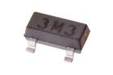
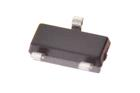
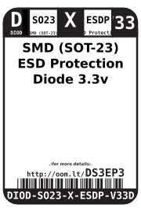
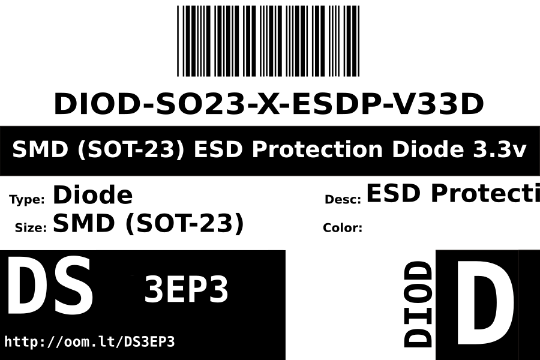

Contents
========

* [DIOD-SO23-X-ESDP-V33D>SMD (SOT-23) ESD Protection Diode 3.3v](#diod-so23-x-esdp-v33dsmd-sot-23-esd-protection-diode-33v)
	* [Images](#images)
	* [Datasheets](#datasheets)
	* [Labels](#labels)
	* [EDA](#eda)
		* [Symbols](#symbols)
	* [Tags](#tags)
  
![][im]
# DIOD-SO23-X-ESDP-V33D>SMD (SOT-23) ESD Protection Diode 3.3v

- ID: DIOD-SO23-X-ESDP-V33D
- Name: DIOD-SO23-X-ESDP-V33D

## Images
  
  

|image|image_BOTTOM|
| :---: | :---: |
|||

## Datasheets

- Datasheet: [datasheet.pdf](datasheet.pdf)

## Labels
  
  

|label-front|label-inventory|label-spec|
| :---: | :---: | :---: |
||||

## EDA

### Symbols

## Tags

- oompID: DIOD-SO23-X-ESDP-V33D
- name: SMD (SOT-23) ESD Protection Diode 3.3v
- hexID: DS3EP3
- oompSort: 
- oompClass: Surface Mount
- oompClassCode: SMDS
- oompType: DIOD
- oompSize: SO23
- oompColor: X
- oompDesc: ESDP
- oompIndex: V33D
- oompVersion: 40
- ooPin1: C
- ooPin2: C
- ooPin3: A
- oompBbls: template;XXXX-SO23-X-XXXX-01-bbls
- oompDiag: template;XXXX-SO23-X-XXXX-01-diag
- oompIden: template;XXXX-SO23-X-XXXX-01-iden
- oompSchem: template;DIOS-XXXX-X-ESDP-XX-schem
- oompSimp: template;XXXX-SO23-X-XXXX-01-simp
- ooPackageMarking: 3M3
- ooDesignator: D1

[im]: image_600.jpg
