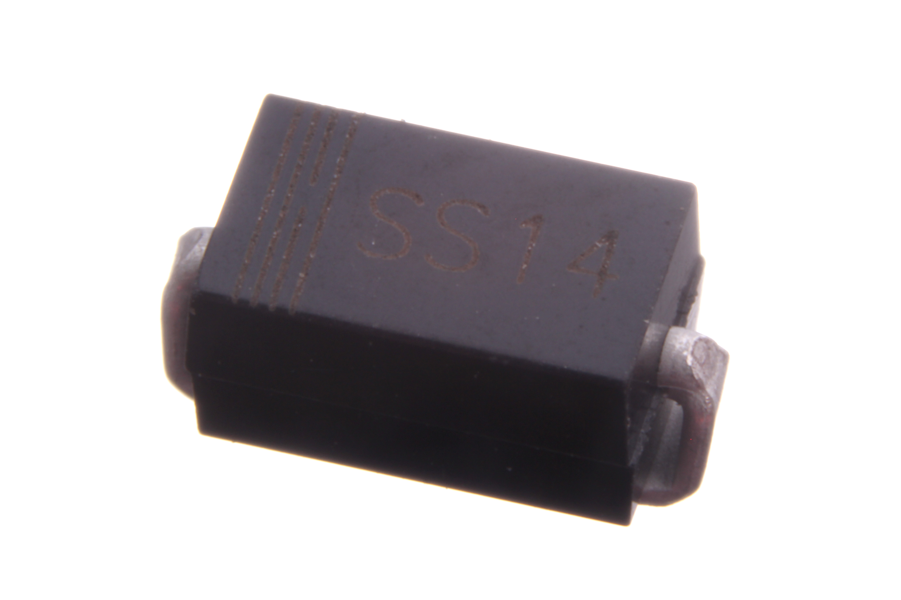
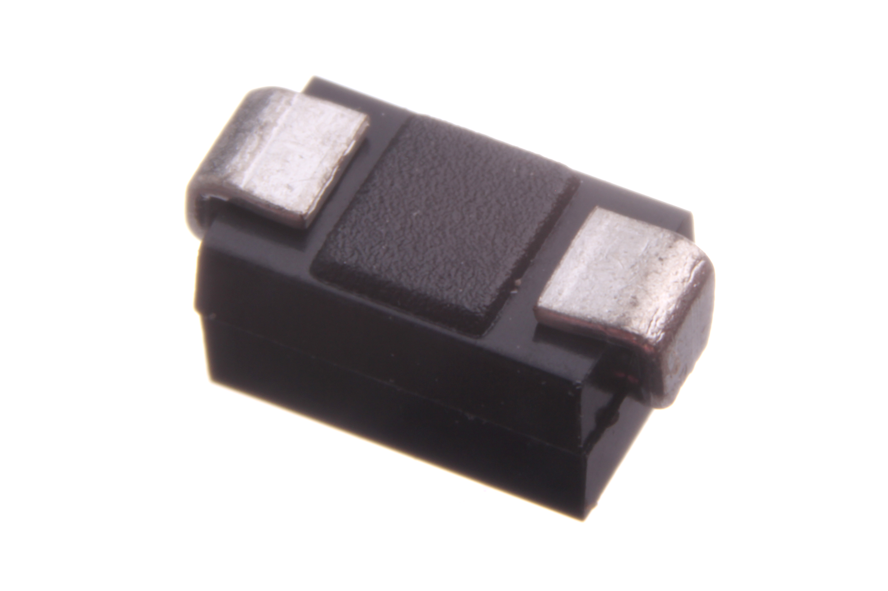
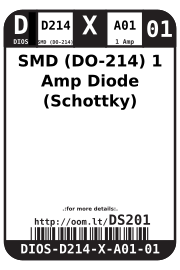
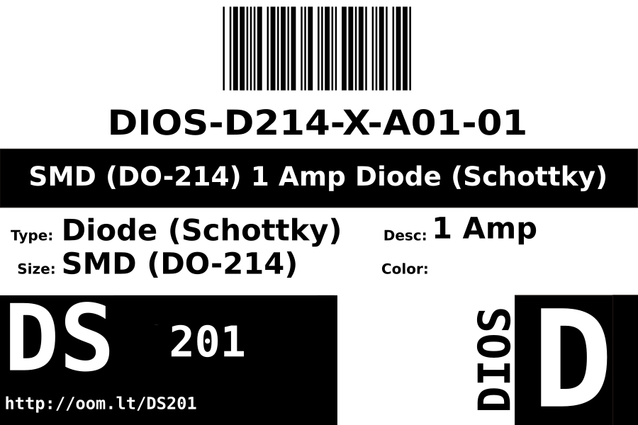

Contents
========

* [DIOS-D214-X-A01-01>SMD (DO-214) 1 Amp Diode (Schottky)](#dios-d214-x-a01-01smd-do-214-1-amp-diode-schottky)
	* [Images](#images)
	* [Datasheets](#datasheets)
	* [Labels](#labels)
	* [EDA](#eda)
		* [Symbols](#symbols)
	* [Tags](#tags)
  
![][im]
# DIOS-D214-X-A01-01>SMD (DO-214) 1 Amp Diode (Schottky)

- ID: DIOS-D214-X-A01-01
- Name: DIOS-D214-X-A01-01

## Images
  
  

|Main|Bottom|
| :---: | :---: |
|||

## Datasheets

- Datasheet: [datasheet.pdf](datasheet.pdf)

## Labels
  
  

|Front|Inventory|Specifications|
| :---: | :---: | :---: |
||||

## EDA

### Symbols

## Tags

- hexID: DS201
- oompSort: 
- oompClass: Surface Mount
- oompClassCode: SMDS
- oompType: DIOS
- oompSize: D214
- oompColor: X
- oompDesc: A01
- oompIndex: 01
- oompVersion: 40
- oompSchem: template;DIOS-XXXX-X-XXXX-XX-schem
- ooDesignator: D1

[im]: image_600.jpg
