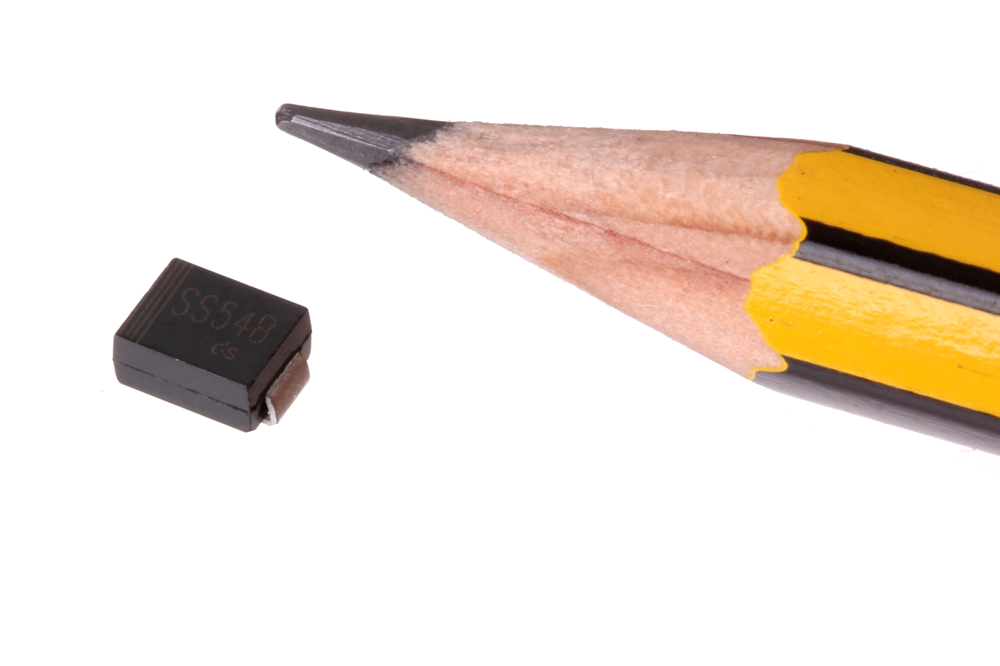
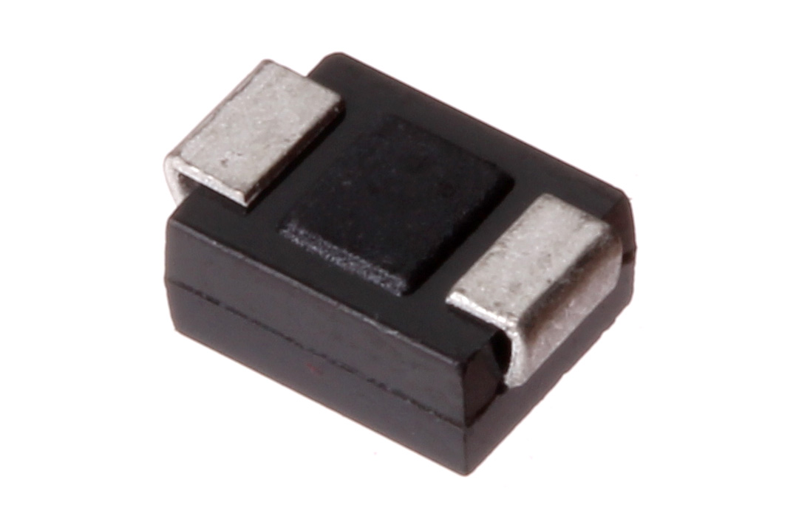

Contents
========

* [DIOS-D214-X-A05-01>SMD (DO-214) 5 Amp Diode (Schottky)](#dios-d214-x-a05-01smd-do-214-5-amp-diode-schottky)
	* [Images](#images)
	* [Datasheets](#datasheets)
	* [EDA](#eda)
		* [Footprints](#footprints)
		* [Symbols](#symbols)
	* [Tags](#tags)

# DIOS-D214-X-A05-01>SMD (DO-214) 5 Amp Diode (Schottky)

- ID: DIOS-D214-X-A05-01
- Name: DIOS-D214-X-A05-01

## Images
  
  

|Main|Reference|Bottom|
| :---: | :---: | :---: |
||||

## Datasheets

- Datasheet: [datasheet.pdf](datasheet.pdf)

## EDA

### Footprints
  

|||||
| :---: | :---: | :---: | :---: |

### Symbols

## Tags

- index: 155
- oompID: DIOS-D214-X-A05-01
- name: SMD (DO-214) 5 Amp Diode (Schottky)
- hexID: DS205
- oompSort: 
- oompClass: Surcace Mount
- oompClassCode: SMDS
- oompType: DIOS
- oompSize: D214
- oompColor: X
- oompDesc: A05
- oompIndex: 01
- oompVersion: 40
- oompSchem: template;DIOS-XXXX-X-XXXX-XX-schem
- ooDesignator: D1
