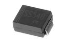
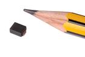
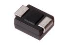
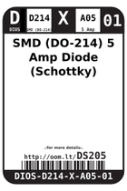
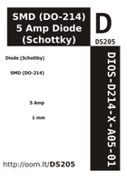

Contents
========

* [DS205 > SMD (DO-214) 5 Amp Diode (Schottky)](#ds205--smd-do-214-5-amp-diode-schottky)
	* [Images](#images)
	* [Datasheets](#datasheets)
	* [Labels](#labels)
	* [EDA](#eda)
	* [Tags](#tags)
  
![][im]
# DS205 > SMD (DO-214) 5 Amp Diode (Schottky)

- ID: DIOS-D214-X-A05-01
- Hex ID: DS205
- Name: SMD (DO-214) 5 Amp Diode (Schottky)
- Description: SMD (DO-214) 5 Amp Diode (Schottky)

## Images
  
  

|image|image_RE|image_BOTTOM|label-front|label-inventory|label-spec|
| :---: | :---: | :---: | :---: | :---: | :---: |
|||||||

## Datasheets

- Datasheet: [datasheet.pdf](datasheet.pdf)

## Labels
  
  

|label-front|label-inventory|label-spec|
| :---: | :---: | :---: |
||||

## EDA

### Symbols

## Tags

- oompID: DIOS-D214-X-A05-01
- name: SMD (DO-214) 5 Amp Diode (Schottky)
- hexID: DS205
- oompSort: 
- oompClass: Surcace Mount
- oompClassCode: SMDS
- oompType: DIOS
- oompSize: D214
- oompColor: X
- oompDesc: A05
- oompIndex: 01
- oompVersion: 40
- oompSchem: template;DIOS-XXXX-X-XXXX-XX-schem
- ooDesignator: D1

[im]: image_450.jpg
