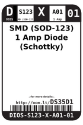
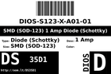
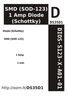

Contents
========

* [DS35D1 > SMD (SOD-123) 1 Amp Diode (Schottky)](#ds35d1--smd-sod-123-1-amp-diode-schottky)
	* [Images](#images)
	* [Datasheets](#datasheets)
	* [Labels](#labels)
	* [EDA](#eda)
	* [Tags](#tags)

# DS35D1 > SMD (SOD-123) 1 Amp Diode (Schottky)

- ID: DIOS-S123-X-A01-01
- Hex ID: DS35D1
- Name: SMD (SOD-123) 1 Amp Diode (Schottky)
- Description: SMD (SOD-123) 1 Amp Diode (Schottky)

## Images
  
  

|label-front|label-inventory|label-spec|
| :---: | :---: | :---: |
||||

## Datasheets

- Datasheet: [datasheet.pdf](datasheet.pdf)

## Labels
  
  

|label-front|label-inventory|label-spec|
| :---: | :---: | :---: |
||||

## EDA

### Symbols

## Tags

- oompID: DIOS-S123-X-A01-01
- name: SMD (SOD-123) 1 Amp Diode (Schottky)
- hexID: DS35D1
- oompSort: DIOSS123A01
- oompType: DIOS
- oompSize: S123
- oompColor: X
- oompDesc: A01
- oompIndex: 01
- oompVersion: 98
- ooNumPins: 2
- ooPackageMarking: SF
- ooDesignator: D1
