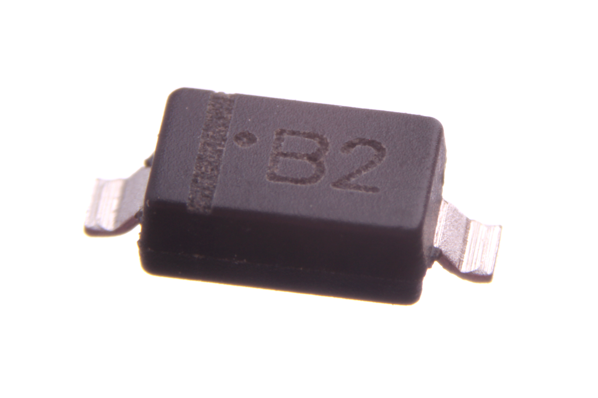
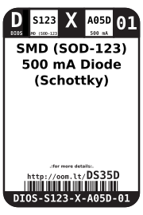

Contents
========

* [DIOS-S123-X-A05D-01>SMD (SOD-123) 500 mA Diode (Schottky)](#dios-s123-x-a05d-01smd-sod-123-500-ma-diode-schottky)
	* [Images](#images)
	* [Datasheets](#datasheets)
	* [Labels](#labels)
	* [EDA](#eda)
		* [Symbols](#symbols)
	* [Tags](#tags)
  
![][im]
# DIOS-S123-X-A05D-01>SMD (SOD-123) 500 mA Diode (Schottky)

- ID: DIOS-S123-X-A05D-01
- Name: DIOS-S123-X-A05D-01

## Images
  
  

|Main|
| :---: |
||

## Datasheets

- Datasheet: [datasheet.pdf](datasheet.pdf)

## Labels
  
  

|Front|Inventory|Specifications|
| :---: | :---: | :---: |
||||

## EDA

### Symbols

## Tags

- index: 157
- oompID: DIOS-S123-X-A05D-01
- name: SMD (SOD-123) 500 mA Diode (Schottky)
- hexID: DS35D
- oompSort: 
- oompClass: Surface Mount
- oompClassCode: SMDS
- oompType: DIOS
- oompSize: S123
- oompColor: X
- oompDesc: A05D
- oompIndex: 01
- oompVersion: 40
- oompSchem: template;DIOS-XXXX-X-XXXX-XX-schem
- ooDesignator: D1

[im]: image_600.jpg
