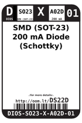
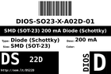
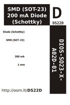

Contents
========

* [DS22D > SMD (SOT-23) 200 mA Diode (Schottky)](#ds22d--smd-sot-23-200-ma-diode-schottky)
	* [Datasheets](#datasheets)
	* [Labels](#labels)
	* [EDA](#eda)
	* [Images](#images)
	* [Tags](#tags)
  
![][im]
# DS22D > SMD (SOT-23) 200 mA Diode (Schottky)

- ID: DIOS-SO23-X-A02D-01
- Hex ID: DS22D
- Name: SMD (SOT-23) 200 mA Diode (Schottky)
- Description: SMD (SOT-23) 200 mA Diode (Schottky)
- Long Link: [http://oom.lt/DIOS-SO23-X-A02D-01](http://oom.lt/DIOS-SO23-X-A02D-01)
- Long Link: [http://oom.lt/DS22D](http://oom.lt/DS22D)

## Datasheets

- Datasheet: [datasheet.pdf](datasheet.pdf)

## Labels
  
  

|label-front|label-inventory|label-spec|
| :---: | :---: | :---: |
||||

## EDA

### Symbols

## Images
  
  

|image|image_BOTTOM|label-front|label-inventory|label-spec|
| :---: | :---: | :---: | :---: | :---: |
||||||

## Tags

- oompID: DIOS-SO23-X-A02D-01
- name: SMD (SOT-23) 200 mA Diode (Schottky)
- hexID: DS22D
- oompSort: 
- oompClass: Surface Mount
- oompClassCode: SMDS
- oompType: DIOS
- oompSize: SO23
- oompColor: X
- oompDesc: A02D
- oompIndex: 01
- oompVersion: 40
- ooPin1: A
- ooPin2: NC
- ooPin3: C
- oompBbls: template;XXXX-SO23-X-XXXX-01-bbls
- oompDiag: template;XXXX-SO23-X-XXXX-01-diag
- oompIden: template;XXXX-SO23-X-XXXX-01-iden
- oompSchem: template;DIOS-XXXX-X-XXXX-XX-schem
- oompSimp: template;XXXX-SO23-X-XXXX-01-simp
- ooPackageMarking: 2TY
- ooDesignator: Q1

[im]: image_450.jpg
