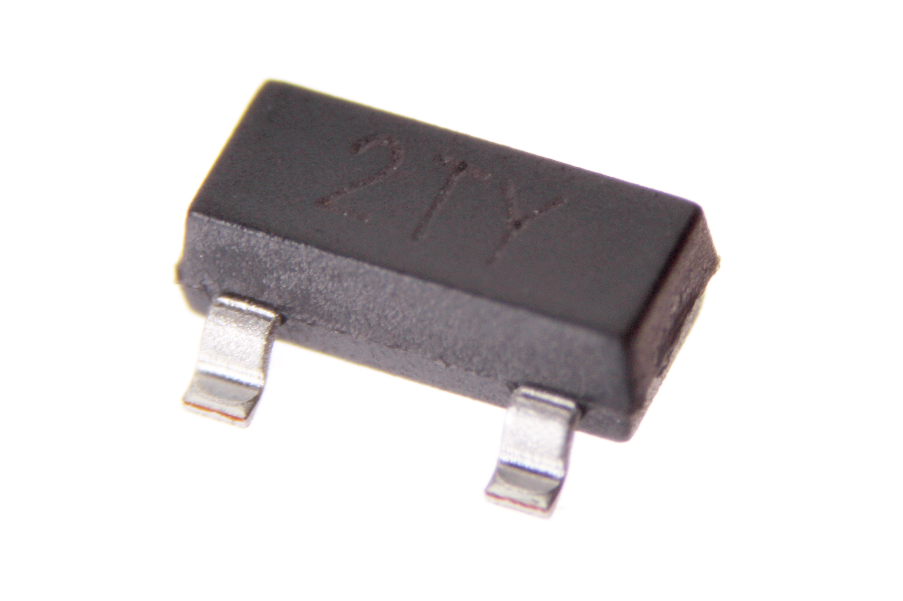
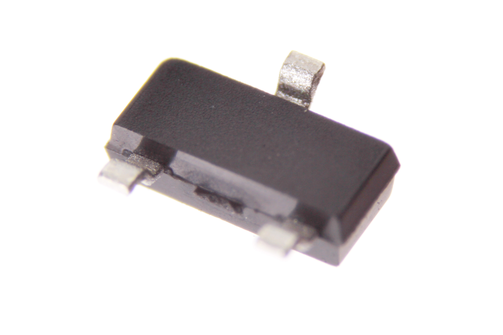

Contents
========

* [DIOS-SO23-X-A02D-01>SMD (SOT-23) 200 mA Diode (Schottky)](#dios-so23-x-a02d-01smd-sot-23-200-ma-diode-schottky)
	* [Images](#images)
	* [Datasheets](#datasheets)
	* [EDA](#eda)
		* [Footprints](#footprints)
		* [Symbols](#symbols)
	* [Tags](#tags)
  
![][im]
# DIOS-SO23-X-A02D-01>SMD (SOT-23) 200 mA Diode (Schottky)

- ID: DIOS-SO23-X-A02D-01
- Name: DIOS-SO23-X-A02D-01

## Images
  
  

|Main|Bottom|
| :---: | :---: |
|||

## Datasheets

- Datasheet: [datasheet.pdf](datasheet.pdf)

## EDA

### Footprints
  

|||||
| :---: | :---: | :---: | :---: |

### Symbols

## Tags

- index: 159
- oompID: DIOS-SO23-X-A02D-01
- name: SMD (SOT-23) 200 mA Diode (Schottky)
- hexID: DS22D
- oompSort: 
- oompClass: Surface Mount
- oompClassCode: SMDS
- oompType: DIOS
- oompSize: SO23
- oompColor: X
- oompDesc: A02D
- oompIndex: 01
- oompVersion: 40
- ooPin1: A
- ooPin2: NC
- ooPin3: C
- oompBbls: template;XXXX-SO23-X-XXXX-01-bbls
- oompDiag: template;XXXX-SO23-X-XXXX-01-diag
- oompIden: template;XXXX-SO23-X-XXXX-01-iden
- oompSchem: template;DIOS-XXXX-X-XXXX-XX-schem
- oompSimp: template;XXXX-SO23-X-XXXX-01-simp
- ooPackageMarking: 2TY
- ooDesignator: Q1

[im]: image_600.jpg
