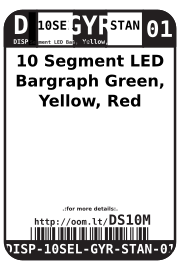
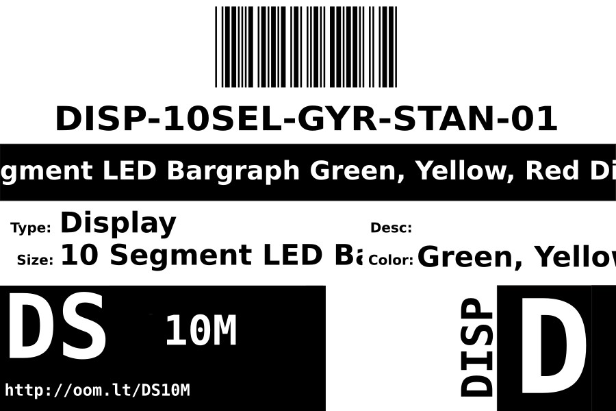

Contents
========

* [DISP-10SEL-GYR-STAN-01>10 Segment LED Bargraph Green, Yellow, Red Display](#disp-10sel-gyr-stan-0110-segment-led-bargraph-green-yellow-red-display)
	* [Datasheets](#datasheets)
	* [Labels](#labels)
	* [EDA](#eda)
		* [Symbols](#symbols)
	* [Tags](#tags)

# DISP-10SEL-GYR-STAN-01>10 Segment LED Bargraph Green, Yellow, Red Display

- ID: DISP-10SEL-GYR-STAN-01
- Name: DISP-10SEL-GYR-STAN-01

## Datasheets

- Datasheet: [datasheet.pdf](datasheet.pdf)

## Labels
  
  

|Front|Inventory|Specifications|
| :---: | :---: | :---: |
||||

## EDA

### Symbols

## Tags

- index: 12459
- oompID: DISP-10SEL-GYR-STAN-01
- name: 10 Segment LED Bargraph Green, Yellow, Red Display
- hexID: DS10M
- oompSort: DISP10SELSTAN
- oompType: DISP
- oompSize: 10SEL
- oompColor: GYR
- oompDesc: STAN
- oompIndex: 01
- oompVersion: 98
- ooWidth: 10.10 mm
- ooLength: 25.4 mm
- ooNumPins: 20
- ooDesignator: D1
