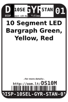

Contents
========

* [DS10M > 10 Segment LED Bargraph Green, Yellow, Red Display](#ds10m--10-segment-led-bargraph-green-yellow-red-display)
	* [Datasheets](#datasheets)
	* [Labels](#labels)
	* [EDA](#eda)
	* [Images](#images)
	* [Tags](#tags)

# DS10M > 10 Segment LED Bargraph Green, Yellow, Red Display

- ID: DISP-10SEL-GYR-STAN-01
- Hex ID: DS10M
- Name: 10 Segment LED Bargraph Green, Yellow, Red Display
- Description: 10 Segment LED Bargraph Green, Yellow, Red Display
- Long Link: [http://oom.lt/DISP-10SEL-GYR-STAN-01](http://oom.lt/DISP-10SEL-GYR-STAN-01)
- Short Link: [http://oom.lt/DS10M](http://oom.lt/DS10M)

## Datasheets

- Datasheet: [datasheet.pdf](datasheet.pdf)

## Labels
  
  

|label-front|label-inventory|label-spec|
| :---: | :---: | :---: |
||||

## EDA

### Symbols

## Images
  
  

|label-front|label-inventory|label-spec|
| :---: | :---: | :---: |
||||

## Tags

- oompID: DISP-10SEL-GYR-STAN-01
- name: 10 Segment LED Bargraph Green, Yellow, Red Display
- hexID: DS10M
- oompSort: DISP10SELSTAN
- oompType: DISP
- oompSize: 10SEL
- oompColor: GYR
- oompDesc: STAN
- oompIndex: 01
- oompVersion: 98
- ooWidth: 10.10 mm
- ooLength: 25.4 mm
- ooNumPins: 20
- ooDesignator: D1
