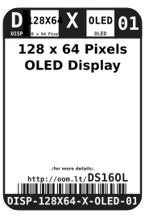

Contents
========

* [DISP-128X64-X-OLED-01>128 x 64 Pixels OLED Display](#disp-128x64-x-oled-01128-x-64-pixels-oled-display)
	* [Datasheets](#datasheets)
	* [Labels](#labels)
	* [EDA](#eda)
		* [Symbols](#symbols)
	* [Tags](#tags)

# DISP-128X64-X-OLED-01>128 x 64 Pixels OLED Display

- ID: DISP-128X64-X-OLED-01
- Name: DISP-128X64-X-OLED-01

## Datasheets

- Datasheet: [datasheet.pdf](datasheet.pdf)

## Labels
  
  

|Front|Inventory|Specifications|
| :---: | :---: | :---: |
||||

## EDA

### Symbols

## Tags

- hexID: DS16OL
- oompSort: 
- oompClass: Surface Mount
- oompClassCode: SMDS
- oompType: DISP
- oompSize: 128X64
- oompColor: X
- oompDesc: OLED
- oompIndex: 01
- oompVersion: 40
- ooDesignator: DS1
