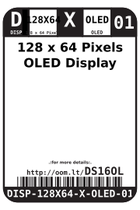
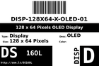
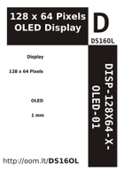

Contents
========

* [DS16OL > 128 x 64 Pixels OLED Display](#ds16ol--128-x-64-pixels-oled-display)
	* [Datasheets](#datasheets)
	* [Labels](#labels)
	* [EDA](#eda)
	* [Images](#images)
	* [Tags](#tags)

# DS16OL > 128 x 64 Pixels OLED Display

- ID: DISP-128X64-X-OLED-01
- Hex ID: DS16OL
- Name: 128 x 64 Pixels OLED Display
- Description: 128 x 64 Pixels OLED Display
- Long Link: [http://oom.lt/DISP-128X64-X-OLED-01](http://oom.lt/DISP-128X64-X-OLED-01)
- Short Link: [http://oom.lt/DS16OL](http://oom.lt/DS16OL)

## Datasheets

- Datasheet: [datasheet.pdf](datasheet.pdf)

## Labels
  
  

|label-front|label-inventory|label-spec|
| :---: | :---: | :---: |
||||

## EDA

### Symbols

## Images
  
  

|label-front|label-inventory|label-spec|
| :---: | :---: | :---: |
||||

## Tags

- oompID: DISP-128X64-X-OLED-01
- name: 128 x 64 Pixels OLED Display
- hexID: DS16OL
- oompSort: 
- oompClass: Surface Mount
- oompClassCode: SMDS
- oompType: DISP
- oompSize: 128X64
- oompColor: X
- oompDesc: OLED
- oompIndex: 01
- oompVersion: 40
- ooDesignator: DS1
