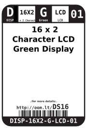
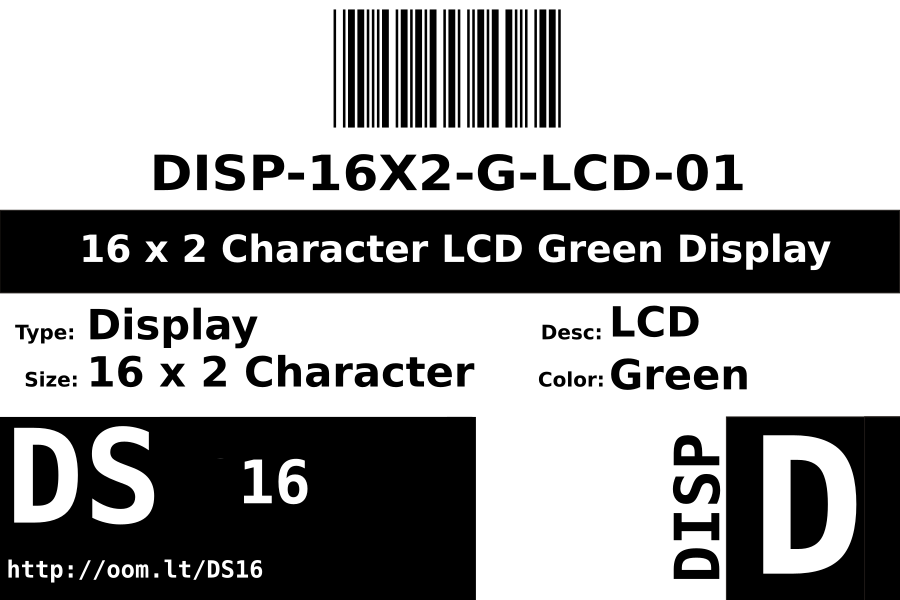

Contents
========

* [DISP-16X2-G-LCD-01> 16 x 2 Character LCD Green Display ](#disp-16x2-g-lcd-01-16-x-2-character-lcd-green-display-)
	* [Images](#images)
	* [Datasheets](#datasheets)
	* [Labels](#labels)
	* [EDA](#eda)
		* [Symbols](#symbols)
	* [Tags](#tags)
  
![][im]
# DISP-16X2-G-LCD-01> 16 x 2 Character LCD Green Display 

- ID: DISP-16X2-G-LCD-01
- Name: DISP-16X2-G-LCD-01

## Images
  
  

|image|
| :---: |
||

## Datasheets

- Datasheet: [datasheet.pdf](datasheet.pdf)

## Labels
  
  

|label-front|label-inventory|label-spec|
| :---: | :---: | :---: |
||||

## EDA

### Symbols

## Tags

- oompID: DISP-16X2-G-LCD-01
- name:  16 x 2 Character LCD Green Display 
- hexID: DS16
- oompSort: DISP16X2LCD
- oompType: DISP
- oompSize: 16X2
- oompColor: G
- oompDesc: LCD
- oompIndex: 01
- oompVersion: 98
- ooPin1: GND
- ooPin2: 5V
- ooPin3: CON
- ooPin4: RS
- ooPin5: R/W
- ooPin6: EN
- ooPin7: D1
- ooPin8: D2
- ooPin9: D3
- ooPin10: D4
- ooPin11: D5
- ooPin12: D6
- ooPin13: D7
- ooPin14: D8
- ooPin15: BL+
- ooPin16: BL-
- oompBbls: template;DISP-16X2-X-LCD-01-bbls
- ooDesignator: D1

[im]: image_600.jpg
