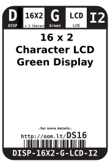
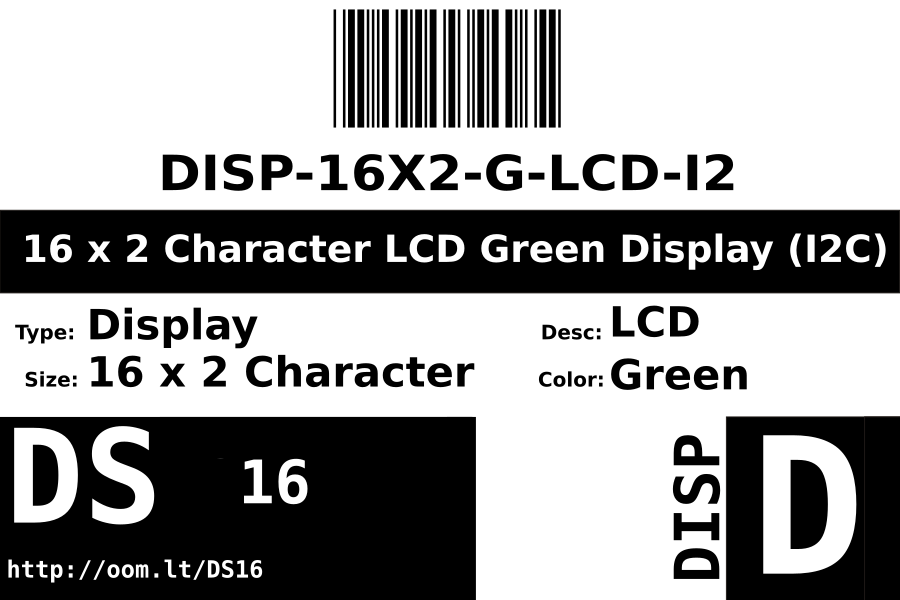
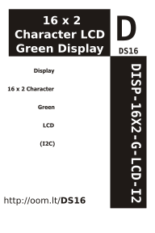

Contents
========

* [DISP-16X2-G-LCD-I2> 16 x 2 Character LCD Green Display (I2C) ](#disp-16x2-g-lcd-i2-16-x-2-character-lcd-green-display-i2c-)
	* [Images](#images)
	* [Labels](#labels)
	* [EDA](#eda)
		* [Symbols](#symbols)
	* [Tags](#tags)
  
![][im]
# DISP-16X2-G-LCD-I2> 16 x 2 Character LCD Green Display (I2C) 

- ID: DISP-16X2-G-LCD-I2
- Name: DISP-16X2-G-LCD-I2

## Images
  
  

|image|
| :---: |
||

## Labels
  
  

|label-front|label-inventory|label-spec|
| :---: | :---: | :---: |
||||

## EDA

### Symbols

## Tags

- oompID: DISP-16X2-G-LCD-I2
- name:  16 x 2 Character LCD Green Display (I2C) 
- hexID: DS16
- oompSort: DISP16X2LCD
- oompType: DISP
- oompSize: 16X2
- oompColor: G
- oompDesc: LCD
- oompIndex: I2
- oompVersion: 98
- ooPin1: SCL
- ooPin2: SDA
- ooPin3: VCC
- ooPin4: GND
- oompBbls: template;DISP-16X2-X-LCD-I2-bbls

[im]: image_600.jpg
