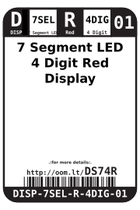
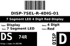

Contents
========

* [DS74R > 7 Segment LED 4 Digit Red Display](#ds74r--7-segment-led-4-digit-red-display)
	* [Images](#images)
	* [Datasheets](#datasheets)
	* [Labels](#labels)
	* [EDA](#eda)
	* [Tags](#tags)
  
![][im]
# DS74R > 7 Segment LED 4 Digit Red Display

- ID: DISP-7SEL-R-4DIG-01
- Hex ID: DS74R
- Name: 7 Segment LED 4 Digit Red Display
- Description: 7 Segment LED 4 Digit Red Display

## Images
  
  

|image|image_RE|image_BOTTOM|label-front|label-inventory|label-spec|
| :---: | :---: | :---: | :---: | :---: | :---: |
|||||||

## Datasheets

- Datasheet: [datasheet.pdf](datasheet.pdf)

## Labels
  
  

|label-front|label-inventory|label-spec|
| :---: | :---: | :---: |
||||

## EDA

### Symbols

## Tags

- oompID: DISP-7SEL-R-4DIG-01
- name: 7 Segment LED 4 Digit Red Display
- hexID: DS74R
- oompSort: DISP07SE4DIG
- oompType: DISP
- oompSize: 7SEL
- oompColor: R
- oompDesc: 4DIG
- oompIndex: 01
- oompVersion: 98
- ooDesignator: DS1

[im]: image_450.jpg
