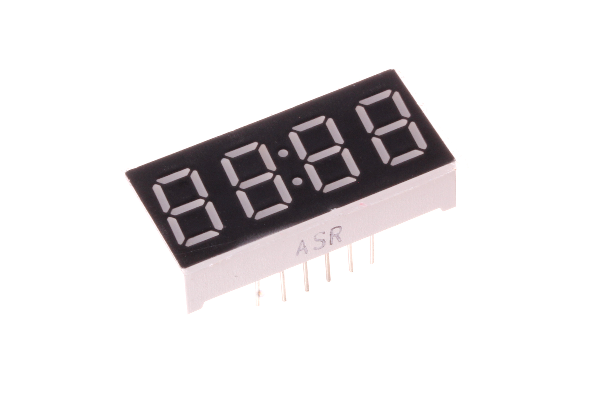
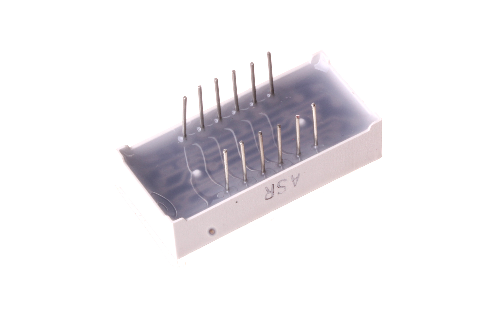

Contents
========

* [DISP-7SEL-R-4DIG-01>7 Segment LED 4 Digit Red Display](#disp-7sel-r-4dig-017-segment-led-4-digit-red-display)
	* [Images](#images)
	* [Datasheets](#datasheets)
	* [EDA](#eda)
		* [Footprints](#footprints)
		* [Symbols](#symbols)
	* [Tags](#tags)

# DISP-7SEL-R-4DIG-01>7 Segment LED 4 Digit Red Display

- ID: DISP-7SEL-R-4DIG-01
- Name: DISP-7SEL-R-4DIG-01

## Images
  
  

|Main|Reference|Bottom|
| :---: | :---: | :---: |
||||

## Datasheets

- Datasheet: [datasheet.pdf](datasheet.pdf)

## EDA

### Footprints
  

|||||
| :---: | :---: | :---: | :---: |

### Symbols

## Tags

- index: 164
- oompID: DISP-7SEL-R-4DIG-01
- name: 7 Segment LED 4 Digit Red Display
- hexID: DS74R
- oompSort: DISP07SE4DIG
- oompType: DISP
- oompSize: 7SEL
- oompColor: R
- oompDesc: 4DIG
- oompIndex: 01
- oompVersion: 98
- ooDesignator: DS1
