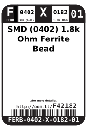
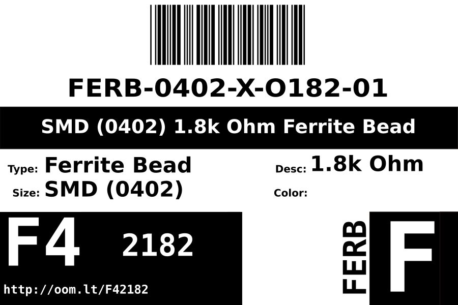

Contents
========

* [FERB-0402-X-O182-01>SMD (0402) 1.8k Ohm Ferrite Bead](#ferb-0402-x-o182-01smd-0402-18k-ohm-ferrite-bead)
	* [Datasheets](#datasheets)
	* [Labels](#labels)
	* [EDA](#eda)
		* [Symbols](#symbols)
	* [Tags](#tags)

# FERB-0402-X-O182-01>SMD (0402) 1.8k Ohm Ferrite Bead

- ID: FERB-0402-X-O182-01
- Name: FERB-0402-X-O182-01

## Datasheets

- Datasheet: [datasheet.pdf](datasheet.pdf)

## Labels
  
  

|Front|Inventory|Specifications|
| :---: | :---: | :---: |
||||

## EDA

### Symbols

## Tags

- index: 12464
- oompID: FERB-0402-X-O182-01
- name: SMD (0402) 1.8k Ohm Ferrite Bead
- hexID: F42182
- oompSort: FERB0402O182
- oompType: FERB
- oompSize: 0402
- oompColor: X
- oompDesc: O182
- oompIndex: 01
- oompVersion: 98
- oompBbls: template;XXXX-0402-X-XXXX-XX-bbls
- oompDiag: template;XXXX-0402-X-XXXX-XX-diag
- oompIden: template;XXXX-0402-X-XXXX-XX-iden
- oompSchem: template;FERB-XXXX-X-XXXX-XX-schem
- oompSimp: template;XXXX-0402-X-XXXX-XX-simp
- ooDesignator: FB1
