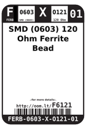

Contents
========

* [F6121 > SMD (0603) 120 Ohm Ferrite Bead](#f6121--smd-0603-120-ohm-ferrite-bead)
	* [Datasheets](#datasheets)
	* [Labels](#labels)
	* [EDA](#eda)
	* [Images](#images)
	* [Tags](#tags)
  
![][im]
# F6121 > SMD (0603) 120 Ohm Ferrite Bead

- ID: FERB-0603-X-O121-01
- Hex ID: F6121
- Name: SMD (0603) 120 Ohm Ferrite Bead
- Description: SMD (0603) 120 Ohm Ferrite Bead
- Long Link: [http://oom.lt/FERB-0603-X-O121-01](http://oom.lt/FERB-0603-X-O121-01)
- Long Link: [http://oom.lt/F6121](http://oom.lt/F6121)

## Datasheets

- Datasheet: [datasheet.pdf](datasheet.pdf)

## Labels
  
  

|label-front|label-inventory|label-spec|
| :---: | :---: | :---: |
||||

## EDA

### Symbols

## Images
  
  

|image|label-front|label-inventory|label-spec|
| :---: | :---: | :---: | :---: |
|||||

## Tags

- oompID: FERB-0603-X-O121-01
- name: SMD (0603) 120 Ohm Ferrite Bead
- hexID: F6121
- oompSort: 
- oompClass: Surface Mount
- oompClassCode: SMDS
- oompType: FERB
- oompSize: 0603
- oompColor: X
- oompDesc: O121
- oompIndex: 01
- oompVersion: 40
- oompBbls: template;XXXX-0603-X-XXXX-XX-bbls
- oompDiag: template;XXXX-0603-X-XXXX-XX-diag
- oompIden: template;XXXX-0603-X-XXXX-XX-iden
- oompSchem: template;FERB-XXXX-X-XXXX-XX-schem
- oompSimp: template;XXXX-0603-X-XXXX-XX-simp
- ooDesignator: FB1

[im]: image_450.jpg
