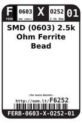
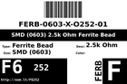

Contents
========

* [F6252 > SMD (0603) 2.5k Ohm Ferrite Bead](#f6252--smd-0603-25k-ohm-ferrite-bead)
	* [Datasheets](#datasheets)
	* [Labels](#labels)
	* [EDA](#eda)
	* [Images](#images)
	* [Tags](#tags)
  
![][im]
# F6252 > SMD (0603) 2.5k Ohm Ferrite Bead

- ID: FERB-0603-X-O252-01
- Hex ID: F6252
- Name: SMD (0603) 2.5k Ohm Ferrite Bead
- Description: SMD (0603) 2.5k Ohm Ferrite Bead
- Long Link: [http://oom.lt/FERB-0603-X-O252-01](http://oom.lt/FERB-0603-X-O252-01)
- Short Link: [http://oom.lt/F6252](http://oom.lt/F6252)

## Datasheets

- Datasheet: [datasheet.pdf](datasheet.pdf)

## Labels
  
  

|label-front|label-inventory|label-spec|
| :---: | :---: | :---: |
||||

## EDA

### Symbols

## Images
  
  

|image|label-front|label-inventory|label-spec|
| :---: | :---: | :---: | :---: |
|||||

## Tags

- oompID: FERB-0603-X-O252-01
- name: SMD (0603) 2.5k Ohm Ferrite Bead
- hexID: F6252
- oompSort: FERB0603O252
- oompType: FERB
- oompSize: 0603
- oompColor: X
- oompDesc: O252
- oompIndex: 01
- oompVersion: 98
- ooWidth: 0.8 mm
- ooLength: 1.6 mm
- ooNumPins: 2
- ooDesignator: L1

[im]: image_450.jpg
