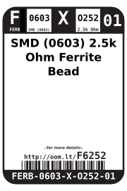
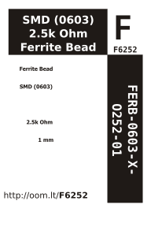

Contents
========

* [FERB-0603-X-O252-01>SMD (0603) 2.5k Ohm Ferrite Bead](#ferb-0603-x-o252-01smd-0603-25k-ohm-ferrite-bead)
	* [Images](#images)
	* [Datasheets](#datasheets)
	* [Labels](#labels)
	* [EDA](#eda)
		* [Symbols](#symbols)
	* [Tags](#tags)
  
![][im]
# FERB-0603-X-O252-01>SMD (0603) 2.5k Ohm Ferrite Bead

- ID: FERB-0603-X-O252-01
- Name: FERB-0603-X-O252-01

## Images
  
  

|image|
| :---: |
||

## Datasheets

- Datasheet: [datasheet.pdf](datasheet.pdf)

## Labels
  
  

|label-front|label-inventory|label-spec|
| :---: | :---: | :---: |
||||

## EDA

### Symbols

## Tags

- oompID: FERB-0603-X-O252-01
- name: SMD (0603) 2.5k Ohm Ferrite Bead
- hexID: F6252
- oompSort: FERB0603O252
- oompType: FERB
- oompSize: 0603
- oompColor: X
- oompDesc: O252
- oompIndex: 01
- oompVersion: 98
- ooWidth: 0.8 mm
- ooLength: 1.6 mm
- ooNumPins: 2
- ooDesignator: L1

[im]: image_600.jpg
