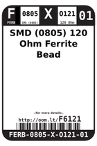
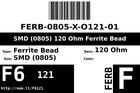
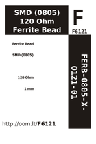

Contents
========

* [F6121 > SMD (0805) 120 Ohm Ferrite Bead](#f6121--smd-0805-120-ohm-ferrite-bead)
	* [Labels](#labels)
	* [EDA](#eda)
	* [Images](#images)
	* [Tags](#tags)

# F6121 > SMD (0805) 120 Ohm Ferrite Bead

- ID: FERB-0805-X-O121-01
- Hex ID: F6121
- Name: SMD (0805) 120 Ohm Ferrite Bead
- Description: SMD (0805) 120 Ohm Ferrite Bead
- Long Link: [http://oom.lt/FERB-0805-X-O121-01](http://oom.lt/FERB-0805-X-O121-01)
- Short Link: [http://oom.lt/F6121](http://oom.lt/F6121)

## Labels
  
  

|label-front|label-inventory|label-spec|
| :---: | :---: | :---: |
||||

## EDA

### Symbols

## Images
  
  

|label-front|label-inventory|label-spec|
| :---: | :---: | :---: |
||||

## Tags

- oompType: FERB
- oompSize: 0805
- oompColor: X
- oompDesc: O121
- oompIndex: 01
- hexID: F6121
- oompID: FERB-0805-X-O121-01
- oompInstances: {'PROJECT': 'PROJ-ADAF-1697-STAN-01', 'ID': 'FB1'}
