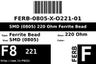
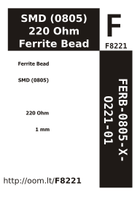

Contents
========

* [F8221 > SMD (0805) 220 Ohm Ferrite Bead](#f8221--smd-0805-220-ohm-ferrite-bead)
	* [Datasheets](#datasheets)
	* [Labels](#labels)
	* [EDA](#eda)
	* [Images](#images)
	* [Tags](#tags)

# F8221 > SMD (0805) 220 Ohm Ferrite Bead

- ID: FERB-0805-X-O221-01
- Hex ID: F8221
- Name: SMD (0805) 220 Ohm Ferrite Bead
- Description: SMD (0805) 220 Ohm Ferrite Bead
- Long Link: [http://oom.lt/FERB-0805-X-O221-01](http://oom.lt/FERB-0805-X-O221-01)
- Short Link: [http://oom.lt/F8221](http://oom.lt/F8221)

## Datasheets

- Datasheet: [datasheet.pdf](datasheet.pdf)

## Labels
  
  

|label-front|label-inventory|label-spec|
| :---: | :---: | :---: |
||||

## EDA

### Footprints
  

|  [kicad/FOOTPRINT-kicad-kicad-footprints-Capacitor_SMD-C_0805_2012Metric](https://github.com/oomlout/oomlout_OOMP_eda/tree/main/footprints/kicad/FOOTPRINT-kicad-kicad-footprints-Capacitor_SMD-C_0805_2012Metric/)|  [kicad/FOOTPRINT-kicad-kicad-footprints-Capacitor_SMD-C_0805_2012Metric_Pad1.18x1.45mm_HandSolder](https://github.com/oomlout/oomlout_OOMP_eda/tree/main/footprints/kicad/FOOTPRINT-kicad-kicad-footprints-Capacitor_SMD-C_0805_2012Metric_Pad1.18x1.45mm_HandSolder/)|  [eagle/FOOTPRINT-eagle-Adafruit-Eagle-Library-adafruit-085CS_1W](https://github.com/oomlout/oomlout_OOMP_eda/tree/main/footprints/eagle/FOOTPRINT-eagle-Adafruit-Eagle-Library-adafruit-085CS_1W/)|  [eagle/FOOTPRINT-eagle-Adafruit-Eagle-Library-adafruit-085CS_1R](https://github.com/oomlout/oomlout_OOMP_eda/tree/main/footprints/eagle/FOOTPRINT-eagle-Adafruit-Eagle-Library-adafruit-085CS_1R/)|
| :---: | :---: | :---: | :---: |
|  [eagle/FOOTPRINT-eagle-Adafruit-Eagle-Library-adafruit-085CS_1AW](https://github.com/oomlout/oomlout_OOMP_eda/tree/main/footprints/eagle/FOOTPRINT-eagle-Adafruit-Eagle-Library-adafruit-085CS_1AW/)|  [eagle/FOOTPRINT-eagle-Adafruit-Eagle-Library-adafruit-085CS_1AR](https://github.com/oomlout/oomlout_OOMP_eda/tree/main/footprints/eagle/FOOTPRINT-eagle-Adafruit-Eagle-Library-adafruit-085CS_1AR/)|  [eagle/FOOTPRINT-eagle-Pimoroni-Eagle-Library-pimoroni-rc-0805_SENSE](https://github.com/oomlout/oomlout_OOMP_eda/tree/main/footprints/eagle/FOOTPRINT-eagle-Pimoroni-Eagle-Library-pimoroni-rc-0805_SENSE/)|  [eagle/FOOTPRINT-eagle-Pimoroni-Eagle-Library-pimoroni-rc-0805](https://github.com/oomlout/oomlout_OOMP_eda/tree/main/footprints/eagle/FOOTPRINT-eagle-Pimoroni-Eagle-Library-pimoroni-rc-0805/)|
|||||

### Symbols

## Images
  
  

|label-front|label-inventory|label-spec|
| :---: | :---: | :---: |
||||

## Tags

- oompID: FERB-0805-X-O221-01
- name: SMD (0805) 220 Ohm Ferrite Bead
- hexID: F8221
- oompSort: 08050000220
- oompType: FERB
- oompSize: 0805
- oompColor: X
- oompDesc: O221
- oompIndex: 01
- oompVersion: 99
- oompSkip: true
- ooWidth: 2 mm
- ooHeight: 0.85 mm
- ooLength: 1.25 mm
- ooNumPins: 2
- oompClass: Surface Mount
- oompClassCode: SMDS
- oompBbls: template;XXXX-0805-X-XXXX-XX-bbls
- oompDiag: template;XXXX-0805-X-XXXX-XX-diag
- oompIden: template;XXXX-0805-X-XXXX-XX-iden
- oompSchem: template;FERB-XXXX-X-XXXX-XX-schem
- oompSimp: template;XXXX-0805-X-XXXX-XX-simp
- ooDesignator: FB1
- footprintEagle: FOOTPRINT-eagle-Adafruit-Eagle-Library-adafruit-085CS_1W
- footprintEagle: FOOTPRINT-eagle-Adafruit-Eagle-Library-adafruit-085CS_1R
- footprintEagle: FOOTPRINT-eagle-Adafruit-Eagle-Library-adafruit-085CS_1AW
- footprintEagle: FOOTPRINT-eagle-Adafruit-Eagle-Library-adafruit-085CS_1AR
- footprintEagle: FOOTPRINT-eagle-Pimoroni-Eagle-Library-pimoroni-rc-0805_SENSE
- footprintEagle: FOOTPRINT-eagle-Pimoroni-Eagle-Library-pimoroni-rc-0805
- footprintKicad: FOOTPRINT-kicad-kicad-footprints-Capacitor_SMD-C_0805_2012Metric
- footprintKicad: FOOTPRINT-kicad-kicad-footprints-Capacitor_SMD-C_0805_2012Metric_Pad1.18x1.45mm_HandSolder
