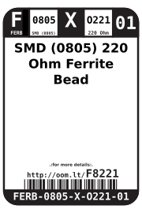

Contents
========

* [FERB-0805-X-O221-01>SMD (0805) 220 Ohm Ferrite Bead](#ferb-0805-x-o221-01smd-0805-220-ohm-ferrite-bead)
	* [Datasheets](#datasheets)
	* [Labels](#labels)
	* [EDA](#eda)
		* [Symbols](#symbols)
	* [Tags](#tags)

# FERB-0805-X-O221-01>SMD (0805) 220 Ohm Ferrite Bead

- ID: FERB-0805-X-O221-01
- Name: FERB-0805-X-O221-01

## Datasheets

- Datasheet: [datasheet.pdf](datasheet.pdf)

## Labels
  
  

|Front|Inventory|Specifications|
| :---: | :---: | :---: |
||||

## EDA

### Symbols

## Tags

- hexID: F8221
- oompSort: 08050000220
- oompType: FERB
- oompSize: 0805
- oompColor: X
- oompDesc: O221
- oompIndex: 01
- oompVersion: 99
- oompSkip: true
- ooWidth: 2 mm
- ooHeight: 0.85 mm
- ooLength: 1.25 mm
- ooNumPins: 2
- oompClass: Surface Mount
- oompClassCode: SMDS
- oompBbls: template;XXXX-0805-X-XXXX-XX-bbls
- oompDiag: template;XXXX-0805-X-XXXX-XX-diag
- oompIden: template;XXXX-0805-X-XXXX-XX-iden
- oompSchem: template;FERB-XXXX-X-XXXX-XX-schem
- oompSimp: template;XXXX-0805-X-XXXX-XX-simp
- ooDesignator: FB1
