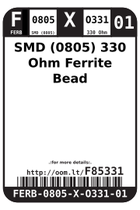
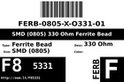
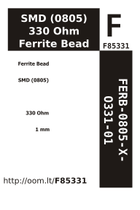

Contents
========

* [F85331 > SMD (0805) 330 Ohm Ferrite Bead](#f85331--smd-0805-330-ohm-ferrite-bead)
	* [Datasheets](#datasheets)
	* [Labels](#labels)
	* [EDA](#eda)
	* [Images](#images)
	* [Tags](#tags)

# F85331 > SMD (0805) 330 Ohm Ferrite Bead

- ID: FERB-0805-X-O331-01
- Hex ID: F85331
- Name: SMD (0805) 330 Ohm Ferrite Bead
- Description: SMD (0805) 330 Ohm Ferrite Bead
- Long Link: [http://oom.lt/FERB-0805-X-O331-01](http://oom.lt/FERB-0805-X-O331-01)
- Short Link: [http://oom.lt/F85331](http://oom.lt/F85331)

## Datasheets

- Datasheet: [datasheet.pdf](datasheet.pdf)

## Labels
  
  

|label-front|label-inventory|label-spec|
| :---: | :---: | :---: |
||||

## EDA

### Footprints
  

|  [FOOTPRINT-eagle-Adafruit-Eagle-Library-adafruit-085CS_1W](https://github.com/oomlout/oomlout_OOMP_eda/tree/main/FOOTPRINT/eagle/Adafruit-Eagle-Library/adafruit/085CS_1W/)|  [FOOTPRINT-eagle-Adafruit-Eagle-Library-adafruit-085CS_1R](https://github.com/oomlout/oomlout_OOMP_eda/tree/main/FOOTPRINT/eagle/Adafruit-Eagle-Library/adafruit/085CS_1R/)|  [FOOTPRINT-eagle-Adafruit-Eagle-Library-adafruit-085CS_1AW](https://github.com/oomlout/oomlout_OOMP_eda/tree/main/FOOTPRINT/eagle/Adafruit-Eagle-Library/adafruit/085CS_1AW/)|  [FOOTPRINT-eagle-Adafruit-Eagle-Library-adafruit-085CS_1AR](https://github.com/oomlout/oomlout_OOMP_eda/tree/main/FOOTPRINT/eagle/Adafruit-Eagle-Library/adafruit/085CS_1AR/)|
| :---: | :---: | :---: | :---: |
|  [FOOTPRINT-eagle-Pimoroni-Eagle-Library-pimoroni-rc-0805_SENSE](https://github.com/oomlout/oomlout_OOMP_eda/tree/main/FOOTPRINT/eagle/Pimoroni-Eagle-Library/pimoroni-rc/0805_SENSE/)|  [FOOTPRINT-eagle-Pimoroni-Eagle-Library-pimoroni-rc-0805](https://github.com/oomlout/oomlout_OOMP_eda/tree/main/FOOTPRINT/eagle/Pimoroni-Eagle-Library/pimoroni-rc/0805/)|  [FOOTPRINT-kicad-kicad-footprints-Capacitor_SMD-C_0805_2012Metric](https://github.com/oomlout/oomlout_OOMP_eda/tree/main/FOOTPRINT/kicad/kicad-footprints/Capacitor_SMD/C_0805_2012Metric/)|  [FOOTPRINT-kicad-kicad-footprints-Capacitor_SMD-C_0805_2012Metric_Pad1.18x1.45mm_HandSolder](https://github.com/oomlout/oomlout_OOMP_eda/tree/main/FOOTPRINT/kicad/kicad-footprints/Capacitor_SMD/C_0805_2012Metric_Pad1.18x1.45mm_HandSolder/)|
|||||

## Images
  
  

|label-front|label-inventory|label-spec|
| :---: | :---: | :---: |
||||

## Tags

- oompID: FERB-0805-X-O331-01
- name: SMD (0805) 330 Ohm Ferrite Bead
- hexID: F85331
- oompSort: FERB0805O331
- oompType: FERB
- oompSize: 0805
- oompColor: X
- oompDesc: O331
- oompIndex: 01
- oompVersion: 98
- ooWidth: 1.25
- ooLength: 2
- ooNumPins: 2
- ooDesignator: L1
- footprintEagle: FOOTPRINT-eagle-Adafruit-Eagle-Library-adafruit-085CS_1W
- footprintEagle: FOOTPRINT-eagle-Adafruit-Eagle-Library-adafruit-085CS_1R
- footprintEagle: FOOTPRINT-eagle-Adafruit-Eagle-Library-adafruit-085CS_1AW
- footprintEagle: FOOTPRINT-eagle-Adafruit-Eagle-Library-adafruit-085CS_1AR
- footprintEagle: FOOTPRINT-eagle-Pimoroni-Eagle-Library-pimoroni-rc-0805_SENSE
- footprintEagle: FOOTPRINT-eagle-Pimoroni-Eagle-Library-pimoroni-rc-0805
- footprintKicad: FOOTPRINT-kicad-kicad-footprints-Capacitor_SMD-C_0805_2012Metric
- footprintKicad: FOOTPRINT-kicad-kicad-footprints-Capacitor_SMD-C_0805_2012Metric_Pad1.18x1.45mm_HandSolder
