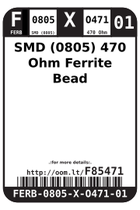
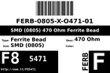
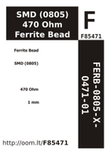

Contents
========

* [F85471 > SMD (0805) 470 Ohm Ferrite Bead](#f85471--smd-0805-470-ohm-ferrite-bead)
	* [Datasheets](#datasheets)
	* [Labels](#labels)
	* [EDA](#eda)
	* [Images](#images)
	* [Tags](#tags)

# F85471 > SMD (0805) 470 Ohm Ferrite Bead

- ID: FERB-0805-X-O471-01
- Hex ID: F85471
- Name: SMD (0805) 470 Ohm Ferrite Bead
- Description: SMD (0805) 470 Ohm Ferrite Bead
- Long Link: [http://oom.lt/FERB-0805-X-O471-01](http://oom.lt/FERB-0805-X-O471-01)
- Short Link: [http://oom.lt/F85471](http://oom.lt/F85471)

## Datasheets

- Datasheet: [datasheet.pdf](datasheet.pdf)

## Labels
  
  

|label-front|label-inventory|label-spec|
| :---: | :---: | :---: |
||||

## EDA

### Symbols

## Images
  
  

|label-front|label-inventory|label-spec|
| :---: | :---: | :---: |
||||

## Tags

- oompID: FERB-0805-X-O471-01
- name: SMD (0805) 470 Ohm Ferrite Bead
- hexID: F85471
- oompSort: FERB0805O471
- oompType: FERB
- oompSize: 0805
- oompColor: X
- oompDesc: O471
- oompIndex: 01
- oompVersion: 98
- ooWidth: 1.25
- ooLength: 2
- ooNumPins: 2
- ooDesignator: L1
