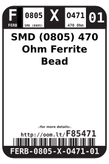

Contents
========

* [FERB-0805-X-O471-01>SMD (0805) 470 Ohm Ferrite Bead](#ferb-0805-x-o471-01smd-0805-470-ohm-ferrite-bead)
	* [Datasheets](#datasheets)
	* [Labels](#labels)
	* [EDA](#eda)
		* [Symbols](#symbols)
	* [Tags](#tags)

# FERB-0805-X-O471-01>SMD (0805) 470 Ohm Ferrite Bead

- ID: FERB-0805-X-O471-01
- Name: FERB-0805-X-O471-01

## Datasheets

- Datasheet: [datasheet.pdf](datasheet.pdf)

## Labels
  
  

|Front|Inventory|Specifications|
| :---: | :---: | :---: |
||||

## EDA

### Symbols

## Tags

- index: 171
- oompID: FERB-0805-X-O471-01
- name: SMD (0805) 470 Ohm Ferrite Bead
- hexID: F85471
- oompSort: FERB0805O471
- oompType: FERB
- oompSize: 0805
- oompColor: X
- oompDesc: O471
- oompIndex: 01
- oompVersion: 98
- ooWidth: 1.25
- ooLength: 2
- ooNumPins: 2
- ooDesignator: L1
