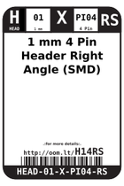
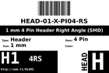
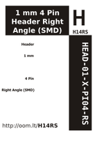

Contents
========

* [H14RS > 1 mm 4 Pin Header Right Angle (SMD)](#h14rs--1-mm-4-pin-header-right-angle-smd)
	* [Labels](#labels)
	* [EDA](#eda)
	* [Images](#images)
	* [Tags](#tags)

# H14RS > 1 mm 4 Pin Header Right Angle (SMD)

- ID: HEAD-01-X-PI04-RS
- Hex ID: H14RS
- Name: 1 mm 4 Pin Header Right Angle (SMD)
- Description: 1 mm 4 Pin Header Right Angle (SMD)
- Long Link: [http://oom.lt/HEAD-01-X-PI04-RS](http://oom.lt/HEAD-01-X-PI04-RS)
- Short Link: [http://oom.lt/H14RS](http://oom.lt/H14RS)

## Labels
  
  

|label-front|label-inventory|label-spec|
| :---: | :---: | :---: |
||||

## EDA

### Symbols
  

|  [SYMBOL-kicad-kicad-symbols-Connector-Conn_01x04_Male](https://github.com/oomlout/oomlout_OOMP_parts/tree/main/SYMBOL-kicad-kicad-symbols-Connector-Conn_01x04_Male/)|  [----](https://github.com/oomlout/oomlout_OOMP_parts/tree/main/----/)|||
| :---: | :---: | :---: | :---: |

## Images
  
  

|label-front|label-inventory|label-spec|
| :---: | :---: | :---: |
||||

## Tags

- oompType: HEAD
- oompSize: 01
- oompColor: X
- oompDesc: PI04
- oompIndex: RS
- hexID: H14RS
- oompID: HEAD-01-X-PI04-RS
- symbolKicad: SYMBOL-kicad-kicad-symbols-Connector-Conn_01x04_Male
- symbolKicad: SYMBOL-kicad-kicad-symbols-Connector_Generic-Conn_01x04_Male
