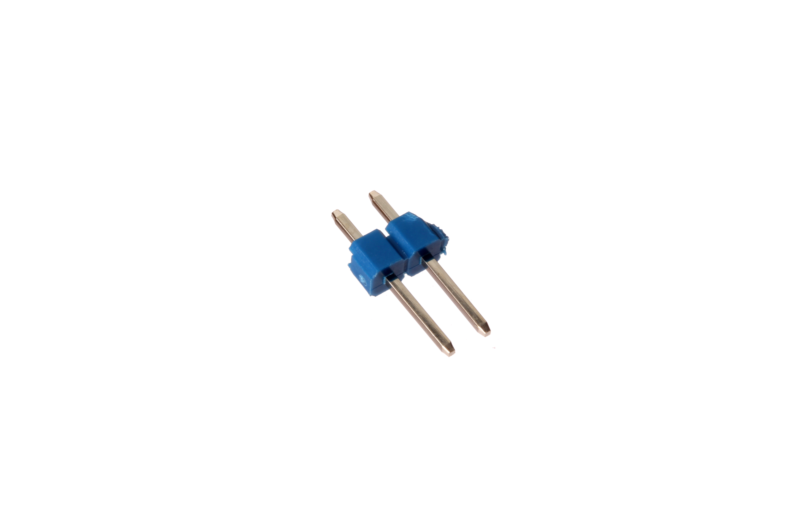
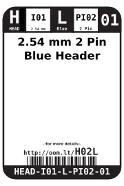
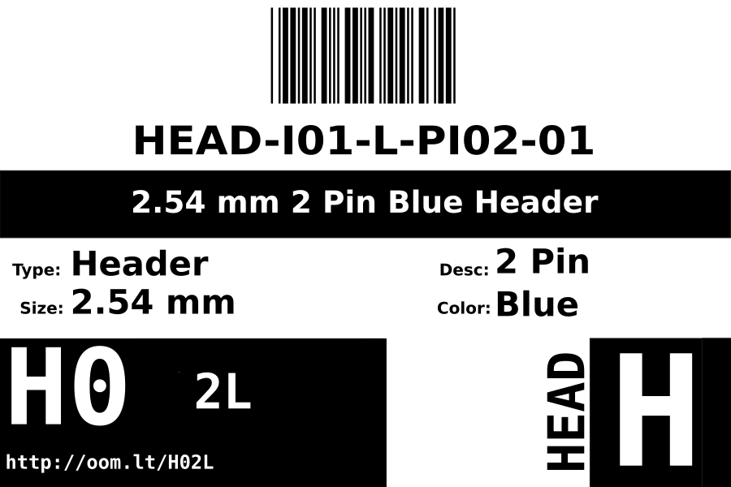
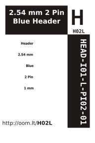

Contents
========

* [HEAD-I01-L-PI02-01>2.54 mm 2 Pin Blue Header](#head-i01-l-pi02-01254-mm-2-pin-blue-header)
	* [Images](#images)
	* [Datasheets](#datasheets)
	* [Labels](#labels)
	* [EDA](#eda)
		* [Symbols](#symbols)
	* [Tags](#tags)
  
![][im]
# HEAD-I01-L-PI02-01>2.54 mm 2 Pin Blue Header

- ID: HEAD-I01-L-PI02-01
- Name: HEAD-I01-L-PI02-01

## Images
  
  

|Main|
| :---: |
||

## Datasheets

- Datasheet: [datasheet.pdf](datasheet.pdf)

## Labels
  
  

|Front|Inventory|Specifications|
| :---: | :---: | :---: |
||||

## EDA

### Symbols

## Tags

- oompID: HEAD-I01-L-PI02-01
- name: 2.54 mm 2 Pin Blue Header
- hexID: H02L
- oompSort: 
- oompClass: Through Hole
- oompClassCode: THTH
- oompType: HEAD
- oompSize: I01
- oompColor: L
- oompDesc: PI02
- oompIndex: 01
- oompVersion: 40
- ooPitch: 2.54
- ooPinHeight: 11.60
- ooPinWidth: 0.64
- ooPinOffset: 1.53
- ooNumPins: 2
- ooFootprint: OOMP-HEAD-I01-X-PI02-01
- oompBbls: variable;clear
- oompBbls: variable;pins;2
- oompBbls: template;XXXX-I01-X-XX-01-bbls
- oompDiag: variable;clear
- oompDiag: variable;pins;2
- oompDiag: template;HEAD-I01-X-XX-01-diag
- oompIden: variable;clear
- oompIden: variable;pins;2
- oompIden: template;XXXX-I01-X-XX-01-iden
- oompSchem: variable;clear
- oompSchem: variable;pins;2
- oompSchem: template;XXXX-XX-X-XX-01-PINS-EVEN-schem
- oompSimp: variable;clear
- oompSimp: variable;pins;2
- oompSimp: template;XXXX-I01-X-XX-01-simp
- ooDesignator: J1
- schematicSymbol: HEAD-XX-X-PI02-XX
- pcbFootprint: HEAD-I01-X-PI02-01

[im]: image_600.jpg
