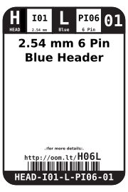
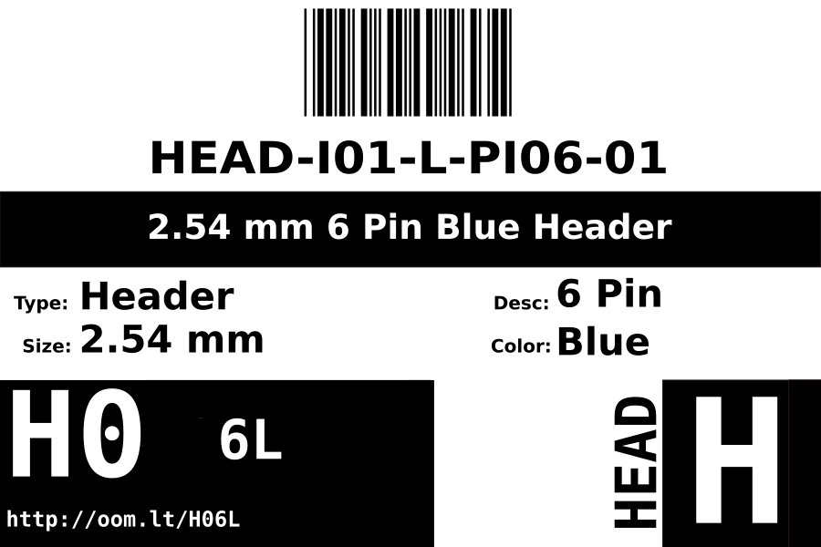
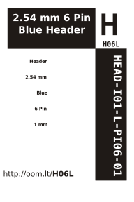

Contents
========

* [HEAD-I01-L-PI06-01>2.54 mm 6 Pin Blue Header](#head-i01-l-pi06-01254-mm-6-pin-blue-header)
	* [Images](#images)
	* [Datasheets](#datasheets)
	* [Labels](#labels)
	* [EDA](#eda)
		* [Symbols](#symbols)
	* [Tags](#tags)
  
![][im]
# HEAD-I01-L-PI06-01>2.54 mm 6 Pin Blue Header

- ID: HEAD-I01-L-PI06-01
- Name: HEAD-I01-L-PI06-01

## Images
  
  

|Main|Reference|
| :---: | :---: |
|||

## Datasheets

- Datasheet: [datasheet.pdf](datasheet.pdf)

## Labels
  
  

|Front|Inventory|Specifications|
| :---: | :---: | :---: |
||||

## EDA

### Symbols

## Tags

- hexID: H06L
- oompSort: 
- oompClass: Through Hole
- oompClassCode: THTH
- oompType: HEAD
- oompSize: I01
- oompColor: L
- oompDesc: PI06
- oompIndex: 01
- oompVersion: 40
- ooPitch: 2.54
- ooPinHeight: 11.60
- ooPinWidth: 0.64
- ooPinOffset: 1.53
- ooNumPins: 6
- ooFootprint: OOMP-HEAD-I01-X-PI06-01
- oompBbls: variable;clear
- oompBbls: variable;pins;6
- oompBbls: template;XXXX-I01-X-XX-01-bbls
- oompDiag: variable;clear
- oompDiag: variable;pins;6
- oompDiag: template;HEAD-I01-X-XX-01-diag
- oompIden: variable;clear
- oompIden: variable;pins;6
- oompIden: template;XXXX-I01-X-XX-01-iden
- oompSchem: variable;clear
- oompSchem: variable;pins;6
- oompSchem: template;XXXX-XX-X-XX-01-PINS-EVEN-schem
- oompSimp: variable;clear
- oompSimp: variable;pins;6
- oompSimp: template;XXXX-I01-X-XX-01-simp
- ooDesignator: J1
- schematicSymbol: HEAD-XX-X-PI06-XX
- pcbFootprint: HEAD-I01-X-PI06-01

[im]: image_600.jpg
